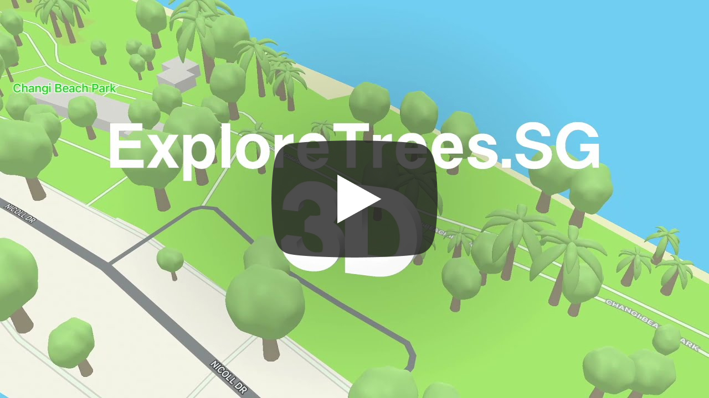

Replicating 3D Trees from Apple Maps
===

On June 2021, Apple’s [WWDC21](https://developer.apple.com/wwdc21/) [event](https://developer.apple.com/videos/play/wwdc2021/101/) announced the all-new [Apple Maps](https://www.apple.com/maps/), introducing an amazing [new three-dimensional city experience](https://techcrunch.com/2021/06/07/apple-maps-upgrade-brings-more-detailed-maps-transit-features-ar-view-and-more/) with unprecedented detail for elevation, neighbourhoods, buildings, trees, and road features.

It looks like this.


There’s a lot going on here, but I’m going to focus on only one.

**Trees**.

Two years ago, I wrote “[Next-level visualizations with ExploreTrees.SG](/blog/2019/07/next-level-visualizations-exploretrees-sg/)”. It has details on how I try to render three-dimensional trees on a map and my experience along the way. I’m not an expert in this topic but I had my fair share of trials and errors while working on it.

Here’s a comparison of my attempt and Apple’s:


They look different but I have to admit, Apple’s one looks *so good*.

Let me recap on how I came up with my attempt in the first place:

1. The trees have to look **semi-realistic**. They cannot be too realistic because they’ll never look like the real thing anyway. Real-world [tree measurement](https://en.wikipedia.org/wiki/Tree_measurement) is actually *very* complicated.
2. There are *way* too many species of trees with different crown shapes and sizes. I settled on a simple sphere geometry with leaves texture. For some reason, I was keen on making the crown see-through (cracks between leaves) because I feel that’s how trees should look like.

Looking at Apple Maps’ trees, I was kind of surprised they also use a sphere *but* with random “bumps”, which gives some form of irregularity. The trunk is also slightly curved and they even add a drop shadow.

I’m so fascinated by this level of detail and decided to study how Apple is designing these trees.

So far, there are three types of trees/crowns.


Obviously Apple didn’t tell us exactly how many and why there are three types. I kind of looked around and deduced that on my own. I could be wrong.

For **weeks**, I’ve been thinking *really* hard why, and one day I realised that these are analogous to the trees in the emoji list:

1. 🌳 [Deciduous tree](https://emojipedia.org/deciduous-tree/)
2. 🌴 [Palm tree](https://emojipedia.org/palm-tree/)
3. 🌲 [Evergreen tree](https://emojipedia.org/evergreen-tree/)

For those emoji fanatics, it’s also known that there *are* two more trees; 🎄 [Christmas tree](https://emojipedia.org/christmas-tree/) and 🎋 [Tanabata tree](https://emojipedia.org/tanabata-tree/). But we all know they are *different* 😉.

Wow, I find this pretty smart. In my own attempt, I was scratching my head on how to diversify the crowns based on the tree families or species. Perhaps I was thinking too much, looking at this diagram from “[Structure of Forest: Crown of Tree, Types, Canopy, Videos and Examples](https://www.toppr.com/guides/science/forest-our-lifeline/structure-of-forest/)”.


Now that I see Apple Maps showing only three types of trees, things seem *easier*.

I mean, why are there only three types of trees in the emoji list in the first place, right? Hmm, I think I’ll leave that question for another day 😜.

Revisiting the code
---

I don’t update my [ExploreTrees.SG project](https://github.com/cheeaun/exploretrees-sg) frequently. I kind of revisit it once a year, while juggling with my other projects, mainly to update the dataset and code dependencies.

I looked at the repository, created a separate folder and started working on it.

On [3 October,](https://twitter.com/cheeaun/status/1444681063792451596) I showed a sneak peek:


I made a new map style on [Mapbox Studio](https://studio.mapbox.com/) that matches Apple Maps’ looks. It’s pretty close but not there yet. Map enthusiasts would notice the change for the roads. It’s grey instead of white, yellow or orange 😉.

I re-used the code and styled the tree crown with green colour, instead of the leaves texture.

The lighting and shadows look a little odd, so I made [some adjustments](https://twitter.com/cheeaun/status/1445043038678441994).


Slightly better.

I wanted to try making the sphere “bumpy”, like the one in Apple Maps.

Using [Spline](https://spline.design/), I manage to [make a 3D model](https://twitter.com/cheeaun/status/1444681069039550468) of a sphere with [displacements](https://docs.spline.design/c6c113a441e74f45bb6c415b4de71b8e).


Unfortunately on Spline, when exporting this to a GLTF model file, it becomes a sphere *without* displacements 😑. Maybe these displacements are just “decorations” on top of the model and not really part of it. I’m not sure since I’m not a 3D designer 😅.

Later on, I figured out that I could make my own displacements by modifying the model itself. Spline has a feature where once a 3D geometry is added, pressing "[Smooth & Edit](https://docs.spline.design/97009e42fe28419d84ac6d580eae8802)" will convert it into a [subdivision surface](https://en.wikipedia.org/wiki/Subdivision_surface). It’s pretty darn powerful because I can edit a surface, line or even a point of *any* surface, drag them, and split them into multiple segments! 🤯


The end result looks **amazing**.


This gives me goosebumps 😬.

To avoid the trees looking too similar, the crowns are initially rotated randomly with JavaScript `Math.random`, but it wasn’t a good solution because every time it’s re-rendered, the crowns’ rotation change.

So, the solution is that they are **deterministically** random, rotated based on the tree ID (string of integers). It’s not complicated; the rotation in degrees is calculated as `(id.slice(-1) / 9) * 180`.

I compared them with Apple Maps, side-by-side.


Left is my attempt on Mapbox tiles. Right is Apple Maps.

It’s pretty close. Maybe the sphere should have more bumps, but I don’t plan to make them *too* similar one-to-one.

Launching a mini-site
---

After spending time on this, I wanted to share my work to the public.

But I have a dilemma here.

ExploreTrees.SG was initially built to be an immersive 2D-based visualisation site for all trees in Singapore. 3D-based trees were an afterthought that I fancied and sort of retrofitted in it.

Having both 2D and 3D mode on a single map or page proves to be quite confusing.

1. 2D is great for visualisations. It’s easier to navigate and understand. 3D negates that advantage due much more complicated panning and rotation gestures with more overwhelming visuals.
2. 3D mode looks *really* cool and gives a spatial overview of how the trees look like in real life. However, it’ll only work best when zoomed in. From a visualisation perspective, it’s harder to grasp the full picture. It’s also more taxing on the visitor’s computer resources.
3. Discovery of the 3D mode feature hasn’t been great. There’s a ‘3D’ button on the right side of the map but I guess most people don’t click it. Users can trigger 3D mode by zooming in and tilting the map but that requires quite a few gestures instead of simple clicks. 3D mode is also only available on more powerful desktop browsers, mainly due to the way it is coded (loading all 500K trees at once).

I decided to create a separate mini-site that strives to do only one thing and do it well.

On 5 October, I [launched **ExploreTrees.sg/3D**](https://twitter.com/cheeaun/status/1445384655201574912).

<video src="../videos/web/exploretrees-sg-3d-launch.mp4" controls></video>

The launch [gathered quite](https://www.linkedin.com/feed/update/urn:li:activity:6851152016014737409/) [a few attention](https://www.reddit.com/r/singapore/comments/q7v0gr/i_rendered_trees_in_sg_to_look_like_the_one_in/) 🤩.

The site is also [featured](https://twitter.com/cheeaun/status/1446280347419774978) on [Maps Mania: Mapping Trees in 3D](https://googlemapsmania.blogspot.com/2021/10/mapping-trees-in-3d.html)!

Post-launch improvements
---

The amazing part here is that I manage to make it work on a mobile browser.

Previously, this was deemed impossible because the site is loading 500+K trees in the browser and causing memory pressure issues.

Here’s a quote from [deck.gl’s documentation](https://deck.gl/docs/developer-guide/performance):

> Modern phones (recent iPhones and higher-end Android phones) are surprisingly capable in terms of rendering performance, but are considerably more sensitive to memory pressure than laptops, resulting in browser restarts or page reloads. They also tend to load data significantly slower than desktop computers, so some tuning is usually needed to ensure a good overall user experience on mobile.

For this mini-site, the page doesn't load all 500+K trees 😉.

The trees data are loaded via [Mapbox tile sets](https://docs.mapbox.com/help/glossary/tileset/). Technically they are vector tiles, broken up into a uniform grid of square tiles at multiple zoom levels. They can be created by converting a GeoJSON file into a `mbtiles` file, using [`tippiecanoe`](https://github.com/mapbox/tippecanoe).

After that, the data is filtered with Mapbox GL JS’s [`queryRenderedFeatures`](https://docs.mapbox.com/mapbox-gl-js/api/map/#map#queryrenderedfeatures) function.

> Returns an array of [GeoJSON](http://geojson.org/) [Feature objects](https://tools.ietf.org/html/rfc7946#section-3.2) representing visible features that satisfy the query parameters.

This can be used to get a list of trees that’s only visible in the current viewport. Think of it like the [Intersection Observer API](https://developer.mozilla.org/en-US/docs/Web/API/Intersection_Observer_API) but for maps.


However, loading a number of trees based on viewport boundary still depends on the map zoom level. When zoomed-in, number of trees could be around 1K and that’s fine. When zoomed-out, number of trees could be over 5K+ and will cause performance issues.

It needs a form of gradual appearance of trees when zooming in.

Observing how Apple Maps work, I came up with a solution — **align the zoom levels with the height of trees**. The logic goes like this:

- Zoom level 0 to 15: don’t show trees.
- Zoom level 15: start showing trees with height more than 24 meters.
- Zoom level 19: show **all** trees (more than 0 meters).

Transitioning between zoom level 15 and 19, the amount of trees shown will be based on height value of 24 meters to 0 meters. In other words, as the user zooms in, the taller trees will appear first and gradually surface the shorter trees. This makes sense because there’s no point rendering short trees when they’re barely visible on lower zoom levels.

The math and code look like this:

```js
const minZoom = 15;
const maxZoom = 19;
const minHeight = 24;
const maxHeight = 0;

const height = Math.max(0, ((zoom - minZoom) / (maxZoom - minZoom)) * (maxHeight - minHeight) + minHeight);

const trees = map.queryRenderedFeatures(geometry, {
  filter: ['>', 'height_est', height],
  layers: ['trees'],
});
```

The `minHeight` value is hardcoded to 24 because I already know the highest value from the dataset, so this may not work for other datasets. The `geometry` variable is the viewport boundary as mentioned above.

Here’s a video of how the experience looks like:

<video src="../videos/web/exploretrees-sg-zoom-level-density-tree-height.mp4" controls></video>

What about the other crowns?
---

The map was showing only deciduous trees. There are still palm trees and evergreen trees left to be done.

Actually, how do I know if a tree is palm tree or evergreen tree?

I researched and figured out that the family for palm trees is [Arecaceae (Palmae)](https://en.wikipedia.org/wiki/Arecaceae). For [Evergreen](https://en.wikipedia.org/wiki/Evergreen) trees, there are **14 families**; Araucariaceae, Cupressaceae, Pinaceae, Podocarpaceae, Taxaceae, Cyatheaceae, Aquifoliaceae, Fagaceae, Oleaceae, Myrtaceae, Arecaceae, Lauraceae, Magnoliaceae, and Cycadaceae. 😵

At this point I realised I’m using these terms differently. For me, they are meant to differentiate the crown shapes, because that’s all I care about for this 3D rendering.

Quoted from [Wikipedia: Deciduous](https://en.wikipedia.org/wiki/Deciduous):

> In the fields of [horticulture](https://en.wikipedia.org/wiki/Horticulture) and [botany](https://en.wikipedia.org/wiki/Botany), the term ***deciduous*** ([/dɪˈsɪdjuːəs/](https://en.wikipedia.org/wiki/Help:IPA/English); [US](https://en.wikipedia.org/wiki/American_English): [/dɪˈsɪdʒuəs/](https://en.wikipedia.org/wiki/Help:IPA/English))[[1\]](https://en.wikipedia.org/wiki/Deciduous#cite_note-1) means "falling off at maturity"[[2\]](https://en.wikipedia.org/wiki/Deciduous#cite_note-2) and "tending to fall off",[[3\]](https://en.wikipedia.org/wiki/Deciduous#cite_note-3) in reference to [trees](https://en.wikipedia.org/wiki/Tree) and [shrubs](https://en.wikipedia.org/wiki/Shrub) that seasonally shed [leaves](https://en.wikipedia.org/wiki/Leaf), usually in the [autumn](https://en.wikipedia.org/wiki/Autumn); to the shedding of [petals](https://en.wikipedia.org/wiki/Petal), after flowering; and to the shedding of ripe [fruit](https://en.wikipedia.org/wiki/Fruit). The [antonym](https://en.wikipedia.org/wiki/Antonym) of *deciduous* in the botanical sense is [evergreen](https://en.wikipedia.org/wiki/Evergreen).

The last sentence caught my attention for some reason.

Okay, the terms don’t relate to the crown shapes at all. In fact, some evergreen trees’s crowns don’t even look like a Christmas tree 🌲🎄. Even more surprising to me, one of the families of Evergreen trees is Arecaceae, which is a 🌴 palm tree! 🤯

To be clear, here’s a Venn diagram of how I understand this:


Anyway, I decided to simplify the scope. According to [Emojipedia](https://emojipedia.org/evergreen-tree/), the meaning of the 🌲 Evergreen tree emoji is:

> An evergreen tree, which keeps green leaves all year round. Depicted as a tall, dark green, cone-shaped tree with shaggy, layered leaves, as a [pine](https://en.wikipedia.org/wiki/Pine) or [fir](https://en.wikipedia.org/wiki/Fir), showing a brown trunk.

Looking at Wikipedia pages of [Pine](https://en.wikipedia.org/wiki/Pine) and [Fir](https://en.wikipedia.org/wiki/Fir), both of them falls under the [Pinaceae](https://en.wikipedia.org/wiki/Pinaceae) family. So let’s do this:

- Evergreen trees = Pinaceae
- Palm trees = Arecaceae (Palmae)

That's it.

Next step would be the 3D models 😅.

Initially, I contemplated a lot on whether I should continue doing this, but after [a few](https://twitter.com/cheeaun/status/1449207768376696835) [practices](https://twitter.com/cheeaun/status/1450057078190403587) [with Spline](https://twitter.com/cheeaun/status/1450851525668925442), I actually [did](https://twitter.com/cheeaun/status/1452646522294652931) [it](https://twitter.com/cheeaun/status/1452675427223228420)!

<video src="../videos/software/palm-tree-crown-3d-model-spline.mp4" controls loop></video>

<video src="../videos/software/evergreen-tree-crown-3d-model-spline.mp4" controls loop></video>

This is one of the most exciting moments of this project 🤩.

I tried rendering the palm tree first, just to see how it’ll look like in the “real world”.


Few points:

- Obviously not all trees are palm trees in Fort Canning 😂
- The palm trees all look the “same”, despite in different sizes, because they’re not randomly rotated yet.
- The colours turn out looking pretty good!

Sprinkled with additional conditions based on the tree family, I managed to [make it all work](https://twitter.com/cheeaun/status/1452805162137894914) together 🌳🌴🌲.


Note that the evergreen-crown trees are at the bottom in the image.

I was curious, do they actually look similar to the real **real world**? 🤔 Let’s compare it to Google StreetView!

**First** [location check](https://twitter.com/cheeaun/status/1452658707599298562): Palm trees at Marina Bay Sands.


Correct. 🤩

**Second** [location check](https://twitter.com/cheeaun/status/1452658707599298562): Evergreen trees at Japanese Garden.


Kind of… correct. 😜

Finally, **everything** rendered in [a single beautiful masterpiece](https://twitter.com/cheeaun/status/1452984083512913923). 💎


<video src="../videos/web/exploretrees-sg-3d-masterpiece.mp4" controls></video>

Applying the finishing touches
---

After the 3D mini-site is live, I made [some updates](https://twitter.com/cheeaun/status/1453360064190894087) to the [main site](https://exploretrees.sg/):

- Fetch the latest dataset
  - June 2020: 578,770 trees → **Oct 2021: 696,228 trees**
  - Moved to a new separate repository: [cheeaun/sgtreesdata](cheeaun/sgtreesdata)
- Upgraded to [Parcel 2](https://parceljs.org/blog/v2/).
- Changed from using MsgPack to plain CSV for the dataset. It’ll be compressed with Brotli and parsed with [PapaParse](https://www.papaparse.com/) on a web worker.
- New custom map styles (probably won’t be noticeable by most people)
- Removed “Flowering” category because I [realised](https://twitter.com/cheeaun/status/1447953820428877824) that this tree characteristic changes often and is actually user-contributed on [Trees.sg](https://trees.sg/).
- Added the ability to filter by tree family!

After making so many screen recordings and videos, I eventually [made](https://twitter.com/cheeaun/status/1453360064190894087) a more professional-looking video to show [what’s new on ExploreTrees.SG](https://www.youtube.com/watch?v=xJL-YhmlWq8).

[](https://www.youtube.com/watch?v=xJL-YhmlWq8)

[Feedback](https://www.reddit.com/r/singapore/comments/qhib9d/whats_new_on_exploretreessg_oct_2021/) was pretty good as I slowly dive into this new way of writing changelogs 😂.

In fact, I had *so much fun* browsing around the mini-site, looking at all the 3D trees, that I took some inspiration from [Apple Maps web site](https://www.apple.com/maps/) and [made](https://twitter.com/cheeaun/status/1454281237007269888) *another* [nice video that feels like flying drone shots around some areas](https://www.youtube.com/watch?v=r0GbNz2cPQ0).

[](https://www.youtube.com/watch?v=r0GbNz2cPQ0)

Honestly I really enjoyed making these videos 😍.

Wrapping up
---

My attempt to replicate Apple Maps’ trees has lead me to learn a variety of new things, from 3D design and modelling to various tree terminologies. The final result may not look *exactly* like it, but it’s pretty close.

Along the journey, I got distracted and accidentally did a [side](https://twitter.com/cheeaun/status/1446490326311444488) [quest](https://twitter.com/cheeaun/status/1447215108145381380) though I manage to return back to this project and finish it 😌.

I could be wrong in certain parts regarding tree families and stuff.  There’s probably more things that I could improve too. I think I’ll revisit this one day when I feel bored or inspired. 😉

I have to say, [ExploreTrees.SG 3D](https://exploretrees.sg/3d/) is officially **the most satisfying and coolest project I've done this year**.

