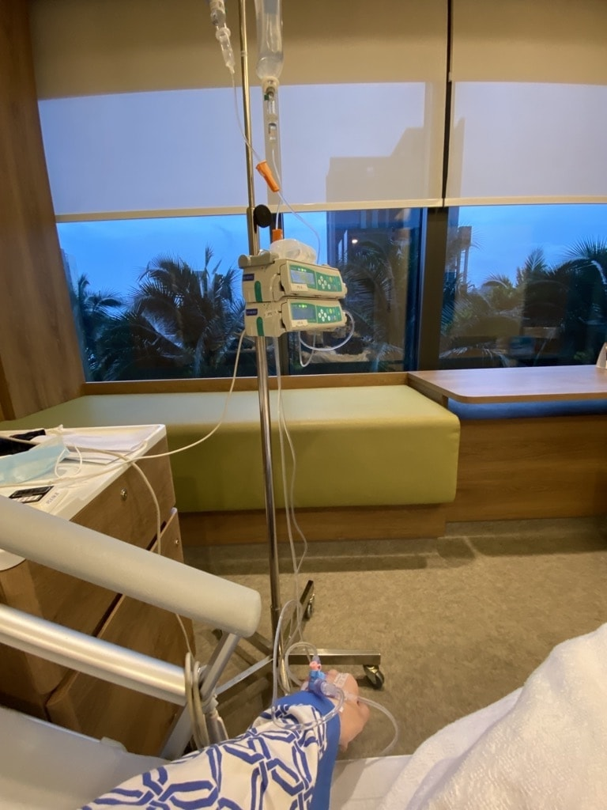

2021 in review
===

It’s still hard to believe how fast this year has gone by. My mind is probably still [stuck](https://covidstandardtime.com/) in [2020](/blog/2020/12/2020-in-review).

Anyway, let’s get on with *the* list.

**January**

- I [got](https://twitter.com/cheeaun/status/1347184779498713089) [two](https://twitter.com/cheeaun/status/1354955983429263360) pretty interesting [GitHub](https://github.com/cheeaun/busrouter-sg/issues/44) [issues](https://github.com/cheeaun/arrivelah/issues/6) on my projects.

**February**

- I *partially* [attended](https://twitter.com/cheeaun/status/1357255170686607360) [Outlier Conf](https://2021.outlierconf.com/). 🎟️
- I [binge-watched](https://twitter.com/cheeaun/status/1357977280547495938) [Yuru Camp△](https://myanimelist.net/anime/34798/Yuru_Camp△). 👀
- [Made](https://twitter.com/cheeaun/status/1361161225078403072) a [map of golf courses in Singapore](https://observablehq.com/@cheeaun/golf-courses-in-singapore). 🏌️🗺️
- Made a [map of cell IDs/towers in Singapore](https://preview.unfolded.ai/public/f31843db-b0b3-495e-8f3b-8b086ad0c7a4). 📶🗺️
- [Experimented](https://twitter.com/cheeaun/status/1363052284448362496) and [made](https://twitter.com/cheeaun/status/1363405719207219201) a [Force Directed Graph of Singapore MRT and LRT networks](https://observablehq.com/@cheeaun/force-directed-graph-of-singapore-mrt-and-lrt-networks). 🚆🗺️
- [Ran Windows XP](https://twitter.com/cheeaun/status/1365614108830130176) on my MacBook Air M1. 🪟

**March**

- I [built a bubble wrap game](https://twitter.com/cheeaun/status/1366931998174973954)! Later on, it even [has its own domain](https://twitter.com/cheeaun/status/1380688663374258176). 🚀👾
- Received [a free mask](https://twitter.com/cheeaun/status/1368046236087951362) from a vending machine. 😷
- Got bored, [started](https://twitter.com/cheeaun/status/1369893562263867394) trial of Apple Arcade and [played a few games](https://twitter.com/cheeaun/status/1372197005586432003). 👾
- Made [a few Xbar](https://twitter.com/cheeaun/status/1373086759647473673) [plugins](https://github.com/cheeaun/xbar-plugins). 🚀

**April**

- I [separated the dataset](https://twitter.com/cheeaun/status/1378667208339902467) from [busrouter.sg](https://github.com/cheeaun/busrouter-sg) to [a separate repository](https://github.com/cheeaun/sgbusdata). 🚀
- [Added a sky](https://twitter.com/cheeaun/status/1379057687799898112) to my ExploreTrees.SG project. 🌳
- Reminisced on [my code editor timeline](https://twitter.com/cheeaun/status/1381587104946216968). 🤔
- Made [my Repokémon project auto-update itself](https://twitter.com/cheeaun/status/1381601099140882433) via GitHub Actions. ♻️
- [Spruced up](https://twitter.com/cheeaun/status/1382006194265411584) my projects page. 💅
- Discovered that [my busrouter.sg project is shown](https://twitter.com/cheeaun/status/1383364541656887298) on a Japanese travel guide book titled "ララチッタ シンガポール(2020年版)". 🇯🇵🚌
- [Sort of attended](https://twitter.com/cheeaun/status/1385078518531256326) [Config 2021](https://config.figma.com/). 🎟️
- I [ordered](https://twitter.com/cheeaun/status/1385566774695907329) one AirTag. 💸
- My [HackerWeb iOS app got featured](https://twitter.com/cheeaun/status/1386289264556658690) on [Expo’s blog post](https://blog.expo.dev/eas-build-april-preview-update-ebd7dff9dd25)! 😎
- I [got](https://twitter.com/cheeaun/status/1386295756823269387) the [Mars 2020 Helicopter Contributor badge](https://github.blog/changelog/2021-04-19-new-badge-for-developers-who-contributed-to-the-mars-2020-helicopter-mission/) on GitHub. 😎🚁

**May**

- I got [hospitalised](https://twitter.com/cheeaun/status/1394273194706542596). 🏥
- [Attended](https://twitter.com/cheeaun/status/1394824474705285128) and [had](https://twitter.com/cheeaun/status/1394984425134362629) [a lot of fun](https://twitter.com/cheeaun/status/1395238943755362307) with [Google I/O 2021](https://io.google/2021/?lng=en). 🎟️
- [Fiddled around](https://twitter.com/cheeaun/status/1395973544983425025) with [Raycast](https://www.raycast.com/). 👨‍💻
- [Open-sourced](https://twitter.com/cheeaun/status/1396332974635851777) my list of [macOS Quick Actions](https://github.com/cheeaun/macos-quick-actions).🚀
- [Had my first try](https://twitter.com/cheeaun/status/1396627450533072896) on GitHub’s [Flat Data](https://next.github.com/projects/flat-data). 🚀
- [Ranted](https://twitter.com/cheeaun/status/1397399784458100737) about USB-C stuff. 🗣️
- Surprised to see that [people remembers](https://twitter.com/cheeaun/status/1397404933532442625) my life timeline. 😲
- Showed [sneak peeks of the new bus routes diagram for busrouter.sg](https://twitter.com/cheeaun/status/1397539071895883782). 🙈
- Learned about [the existence of Mahjong Tiles unicode block](https://twitter.com/cheeaun/status/1398127720903503877). 🤔

**June**

- I [received some nice stickers](https://twitter.com/cheeaun/status/1400039468472553479) from [Red Viola Panda](https://redviolapanda.com/). 👾
- Tried out [new styles for busrouter.sg](https://twitter.com/cheeaun/status/1401406847479812097) and finally [launched the new bus routes diagram](https://twitter.com/cheeaun/status/1401895481467228161). 🚀🚌
- I [experimented](https://twitter.com/cheeaun/status/1403375847944331264) with iOS 15 Mobile Safari’s new location bar. 👨‍🔬
- Received [stickers from Stripe](https://twitter.com/cheeaun/status/1403955820048523268). 👾
- [Tried out Spring](https://twitter.com/cheeaun/status/1404756342926045186) for selling [my merchandise](https://cheeaun.creator-spring.com/). 👕
- Updated [my checkweather.sg project](https://twitter.com/cheeaun/status/1405703342500712453). 🚀
- Released [a new version of HackerWeb iOS app](https://twitter.com/cheeaun/status/1405704797957750785). 🚀
- Took [my first jab](https://twitter.com/cheeaun/status/1406083612861091842). 💉
- Created [a pretty weird CodePen demo](https://twitter.com/cheeaun/status/1406253150667902979). 🚀
- Made [a quick tweet-to-markdown web app](https://twitter.com/cheeaun/status/1406814385696231424). 🚀
- Migrated [a few articles from Medium to my blog](https://twitter.com/cheeaun/status/1406832312419897346). 🚛
- [Received swag](https://twitter.com/cheeaun/status/1407592206853050368) from [WorkerConf](https://www.alpine-conferences.com/worker-conf-2021/). 🎟️
- [Experimented](https://twitter.com/cheeaun/status/1407675202503249921) with iOS 15 Mobile Safari’s UI and `theme-color`. 👨‍🔬
- Manage to run [Windows 11 Insiders Preview on Parallels on Big Sur on Macbook Air M1](https://twitter.com/cheeaun/status/1409832916264243200). 🪟

**July**

- I had the chance to [try out GitHub Copilot](https://twitter.com/cheeaun/status/1410410603529728004). 🧑‍✈️
- I showed [some sneak peeks (again)](https://twitter.com/cheeaun/status/1410615387226394630) and [launched multi-route mode for busrouter.sg](https://twitter.com/cheeaun/status/1412970305140805635).🚀
- I [got a free oximeter](https://twitter.com/cheeaun/status/1413355244667297792). 🆓
- Took [my second jab](https://twitter.com/cheeaun/status/1415870737043263488), experienced [side effects](https://twitter.com/cheeaun/status/1418431152285650945), and got [fully vaccinated](https://twitter.com/cheeaun/status/1420794101167886343). 💉
- I [drew some 3D trees](https://twitter.com/cheeaun/status/1419633341855195139).🌳
- Made [a bar chart race](https://twitter.com/cheeaun/status/1421363787978838018) that animates the percentage of fully vaccinated people over total population per country. 📊

**August**

- I made [my second Flat Data repository](https://twitter.com/cheeaun/status/1422171546605416448). 🚀
- I found [a new sticker vendor and made a video](https://twitter.com/cheeaun/status/1423268264281468930). 👾📹
- Received my [Chipolo ONE Spot](https://twitter.com/cheeaun/status/1426176061474181121). 🚚
- Started work on [adding localisation to busrouter.sg](https://twitter.com/cheeaun/status/1427242976187613189). 🚀
- Updated [RailRouter SG with the new Thomson-East Coast Line 2](https://twitter.com/cheeaun/status/1431537294553632772). 🚀

**September**

- I [collected *free* 50 surgical masks and 25 N95 masks](https://twitter.com/cheeaun/status/1433677112720777218). 😷🆓
- I learnt [a little bit of Rust](https://twitter.com/cheeaun/status/1433998967281311746). 👨‍🏫
- [Hated](https://twitter.com/cheeaun/status/1435190077492064256) pre-commit hooks. 😩
- Received [a sticker](https://twitter.com/cheeaun/status/1435455447327076364) from Mapbox! 👾
- Had [a hard time](https://twitter.com/cheeaun/status/1435887360592408583) reading Redux Saga code. 😩
- [Started](https://twitter.com/cheeaun/status/1437378945083576324) my own [newsletter](https://www.getrevue.co/profile/cheeaun)! 📰
- Had [a hard time](https://twitter.com/cheeaun/status/1438379568075706368) reading `[].reduce` code.
- Did a little [UI adjustments for HackerWeb iOS app](https://twitter.com/cheeaun/status/1438528668700078082). Also a [tiny improvement](https://twitter.com/cheeaun/status/1443089683894792197).
- I [published](https://twitter.com/cheeaun/status/1439962562263539719) ‘[Designing bus service route diagrams on BusRouter SG](/blog/2021/09/bus-service-route-diagrams-busrouter-sg/)’. 📝
- Found [a very interesting bug on iOS 15 Maps app](https://twitter.com/cheeaun/status/1441374915790196743).

**October**

- I showed [some sneak peeks](https://twitter.com/cheeaun/status/1444681063792451596), [launched ExploreTrees.SG 3D](https://twitter.com/cheeaun/status/1445384655201574912), which later got [featured on Maps Mania](https://twitter.com/cheeaun/status/1446280347419774978)! 🚀😎
- I’ve also [experimented](https://twitter.com/cheeaun/status/1446490326311444488) with [3D building tiles](https://twitter.com/cheeaun/status/1447215108145381380) and eventually [launched it](https://twitter.com/cheeaun/status/1447215165225594882). 🚀
- “[Downgraded](https://twitter.com/cheeaun/status/1447569232758149123)” from iPhone 11 Pro to iPhone 13 Mini. 📱
- Made [a pretty darn cool CSS demo](https://twitter.com/cheeaun/status/1448256685869387784). 🆒
- Did a 3D render of [iOS Conf SG logo](https://twitter.com/cheeaun/status/1449207736147664896), [my personal branding logo](https://twitter.com/cheeaun/status/1450057070506512384), and [Geekcamp logo](https://twitter.com/cheeaun/status/1450851525668925442). 🧑‍🎨
- I showed [a few more sneak peeks](https://twitter.com/cheeaun/status/1452645364671016960) and [relaunched ExploreTrees.SG](https://twitter.com/cheeaun/status/1452984083512913923). 🚀
- Also made [a video](https://twitter.com/cheeaun/status/1453360064190894087). And [another one](https://twitter.com/cheeaun/status/1454281237007269888).📹 

**November**

- I showed [sneak peeks](https://twitter.com/cheeaun/status/1455912660097064960) of real-time crowd density data on Singapore MRT/LRT stations, [launched it](https://twitter.com/cheeaun/status/1456171680716312581) and later [got featured on Reddit](https://twitter.com/cheeaun/status/1458037393852751877) and [The SG Life](https://twitter.com/cheeaun/status/1459405203057250304). 🚀😎
- I [published](https://twitter.com/cheeaun/status/1456461587548491781) ‘[Replicating 3D Trees from Apple Maps](/blog/2021/11/replicating-3d-trees-apple-maps/)’. 📝
- [Attended](https://twitter.com/cheeaun/status/1456896124426412037) [Geekcamp](https://twitter.com/cheeaun/status/1457170508915437574). 🎟️
- Received [two of my Kickstarter-backed projects](https://twitter.com/cheeaun/status/1462409151544324105). 🧦🎒
- Tried out [Remix](https://twitter.com/cheeaun/status/1462975493913735169). 💿

**December**

- Finally showed [sneak peeks](https://twitter.com/cheeaun/status/1467122486592430080) and [quietly released the localisation feature for busrouter.sg](https://twitter.com/cheeaun/status/1468220448852692992). 🚀
- Took [a nice photo](https://twitter.com/cheeaun/status/1469681161026740224) from a walk. 🚶
- And [another photo](https://twitter.com/cheeaun/status/1471115374674382852). 📸
- [Received stickers](https://twitter.com/cheeaun/status/1471139735481376768) from Prisma. 👾
- Took [my 3rd jab](https://twitter.com/cheeaun/status/1471809207280177158), experienced [some side effects](https://twitter.com/cheeaun/status/1473511297798979585). 💉
- Celebrated my [15th-year Twitter anniversary](https://twitter.com/cheeaun/status/1471995937392189441). 🎂
- Added [dark mode CSS](https://twitter.com/cheeaun/status/1472023918063931394) to my personal site. 🦆
- Had [some issues](https://twitter.com/cheeaun/status/1475025901477720067) on taxirouter.sg. 🚖
- [Tried token replacement](https://twitter.com/cheeaun/status/1476564114486923267) at the token vending machine. ♻️
- Made my own [2021 remixed video](https://www.youtube.com/watch?v=8DyuI_5bv_g). 📹
- My project got listed in [Maps Mania](https://googlemapsmania.blogspot.com/2021/12/the-50-best-maps-of-year.html)’s [Maps of the Year](http://bl.ocks.org/mapsmania/raw/90a698d0feda36203648b0932c6c26f6/?raw=true). 😎

Health
---

My 2021 is really all about my health. From the first quarter, I’ve been experiencing symptoms like dry mouth and random coughs. After a few visits to the clinic, it seems to be related to my gastric issue, probably reoccurring since [the last time in 2019](/blog/2020/01/2019-in-review/).

On May, suddenly I got hospitalised due to acute migraine and giddiness. Did MRI scan of the brain, nerve test, and MRI scan of the neck. The speculated problem seems to be this weird neck spine structure that I have *since birth*. The doctor basically gave me a lot of painkillers.

The first half of the year has been nerve-racking. Vaccinations were provided for the public based on age, starting from oldest batch to the youngest possible batch. I was waiting very patiently as most of my family members have already been vaccinated with double doses. From June onwards, [vaccinations for students age 12 and above began](https://www.channelnewsasia.com/singapore/covid-19-vaccinations-singapore-students-pfizer-biontech-1828431) and somehow it delayed my batch.

I was actually feeling impatient to get vaccinated because my initial symptoms from beginning of the year are *slightly* similar to the main disease. It’s psychological draining because there are always lingering thoughts that I might have it, or not.

Having it or not, is not the main concern. **Unknowingly spreading it to other vulnerable people** is my number 1 concern. This pandemic has never been about individuals and what everyone thinks about themselves. It has always been about what everyone thinks and cares of the people around them. The thought that we could *unknowingly* spread to other people and destroy their lives is more dreadful than anything that I could think of. The sense of guilt would be unimaginable.

Around April, I remember that the doctor was suggesting that I should do a PCR (Polymerase chain reaction) swab test, the one which they poke the nose deeply. He said, it’s not to suspect that I have it, but it’s more like to give me a sense of relief, if the result is negative. And the result came back negative on the next day, so I *really* felt relieved.

Surprising that the swab test also *indirectly* solves mental health issues.

For the second half of the year, I still have random health issues like gastritis, but it wasn’t as bad anymore. After gaining the “Fully Vaccinated” status (2 doses) at the end of July, it’s another **huge** relief for me, as *everyone* in my current household is also fully vaccinated.

Despite that, number of cases in Singapore were quite high, thanks to the new variants. To slow down the rate of transmission and ease the strain on the healthcare system, there were [some measures](https://www.moh.gov.sg/news-highlights/details/updates-on-local-situation-and-maintaining-the-stabilisation-measures) taken while most of us were still working from home.

Before the end of the year, my family members and I got the booster shots.

## Ups and downs

In 2020, I was sort of still familiarising myself with work-from-home environment. In 2021, I’ve become completely unable to separate work and non-work (life).

Cases were going up and down. Measures, rules and restrictions kept changing so often that we all [need a site to have a quick *and* updated reference](https://www.reddit.com/r/singapore/comments/p2ceew/safe_distancing_sg_latest_safe_distancing_rules/).

I’ve been staying at home most of the time, unable to plan meetings ahead, unable to promise anything, due to my unstable, random occurrences of symptoms. My mind was occupied with work, and sometimes guilt that I’m not performing well enough, while at the same time, I understand that everyone else is going through the same struggle.

My hospitalisation and post-hospitalisation leaves somehow made me felt really good, as I was completely cut off from work. The painkillers are also muscle relaxants and they’re sleep-inducing, thus making me more relaxed and quite refreshed after that.

Sometime around the last quarter of the year, I realised that I haven’t taken long (paid annual) leaves. Before the pandemic, I usually take 7 to 10 days of leaves for my travels. It felt kind of awkward to take non-travel leaves, but the post-hospitalisation leaves made me aware of how important they are. So basically, I applied for a week, and literally try to draw the lines clearly between work and non-work.

Newsletter
---

On September, I [started](https://twitter.com/cheeaun/status/1437378945083576324) [my own newsletter](https://www.getrevue.co/profile/cheeaun)! 📰

[Revue was acquired by Twitter](https://blog.twitter.com/en_us/topics/company/2021/making-twitter-a-better-home-for-writers) and the integration seems like a good time for me to try it out.

My [first issue was sent out](https://www.getrevue.co/profile/cheeaun/issues/hello-newsletter-1-11608) and I mentioned about how I feel about it:

> These days, some tech folks have been into newsletters all over the place. Hype is real, curiosity is strong and therefore I shall dive in to learn more about this.
>
> Emails have been a funny thing for me. In the beginning, everyone uses emails. I subscribed to a lot of newsletters like [*LangaList*](https://www.askwoody.com/newsletter/langalist-is-merging-with-windows-secrets/) and [*LockerGnome*](https://en.wikipedia.org/wiki/Chris_Pirillo) (Anyone remembers them?). Then *maybe* it got spammy, so we move to RSS (blogs & social networks?), then for some reason, we’re back 🔙
>
> I’ve subscribed to a few newsletters myself just to get the feel and so far I like [*cassidoo*‘s style](https://cassidoo.co/newsletter/) the most. This newsletter will follow her style first and slightly remixed with my own unique quirks.

I plan to send the issues on the last day of every month, which I think should be a good “summary”, which rhymes with my [previous](https://twitter.com/cheeaun/status/1365857273877172225) [attempts](https://twitter.com/cheeaun/status/1377232552793018374) [with](https://twitter.com/cheeaun/status/1410197871224254464) [“summary”](https://twitter.com/cheeaun/status/1421328945744470019) [tweets](https://twitter.com/cheeaun/status/1432606412106960897).

When the [second issue](https://www.getrevue.co/profile/cheeaun/issues/newsletter-tober-2-788703) was sent, I realised that I kind of enjoyed writing it.

The newsletter contains 4 sections:

- **Highlights of the month**: I move my “summary” tweets to this section, as a way for me to keep track of things, and also for my followers to keep up with my tweets.
- **Interesting discoveries**: This is mainly for things I sometimes tweet out. This also reminds me of the times when I always share cool stuff to whoever sitting beside me at work, in the office, which is impossible now due to work-from-home setting.
- **Story time**: Due to work-from-home setting again, it’s getting rare to have one of those ad-hoc conversations with friends or colleagues about some random thing I learnt or experienced. Yeah, just a section to make the newsletter feels more personal.
- **Neat bookmarks**: Just a quick list of links. Like the good-old [Delicious](https://en.wikipedia.org/wiki/Delicious_(website)). Also, a reuse of my [old Chrome extension](https://github.com/cheeaun/neat-bookmarks)’s name.

This newsletter is like a cross between my long-form blog posts and my short-form tweets. For the old-schoolers, shouldn’t that be [Tumblr](https://www.tumblr.com/)? 🤷‍♂️

Weirdly enough, I do still post things on my [Tumblr](https://cheeaun.tumblr.com/). 😆

Wrapping up
---

🤕 Honestly speaking, post-vaccination side effects are not fun at all. So is my gastritis.

🔊 Noises, like from road or building constructions, while working from home, are not great.

😎 Of all my projects, [ExploreTrees.SG 3D](/blog/2021/11/replicating-3d-trees-apple-maps/) is officially the most satisfying and coolest project I've done yet.

📹 The most enjoyable video I’ve made is also [ExploreTrees.SG 3D](https://www.youtube.com/watch?v=r0GbNz2cPQ0).

⤴️ [Akihiko Kusanagi](https://github.com/nagix) ([@nagix](https://twitter.com/nagix)) is perhaps my best follow of the year because he made so, so many cool stuffs.

📺 [World Trigger and Kingdom](https://cheeaun.tumblr.com/post/672093252439113728/my-favourite-anime-of-2021) are totally the most anticipated anime series for me.

💻 MacBook Air M1 is my most rewarding investment (bought before 2021) among all the random things I bought.

🛩️ No travels. Still too [troublesome](https://mothership.sg/2021/11/singapore-kl-vtl-price/). Things are still [in flux](https://www.channelnewsasia.com/singapore/covid-19-moh-freeze-vtl-ticket-sales-limit-exposure-omicron-2395081). Not the highest priority as of now.

Yeah, time flies.
