Chengyu Wordle Is Not a Love Story
===

From The New York Times article “[Wordle Is a Love Story](https://www.nytimes.com/2022/01/03/technology/wordle-word-game-creator.html)”, it began as a sweet love [story](https://youtu.be/X_e2IEaR4aA?t=1019) of [Josh Wardle](https://en.wikipedia.org/wiki/Josh_Wardle) building a game for his partner. It became super popular and now has [its own Wikipedia page](https://en.wikipedia.org/wiki/Wordle).


I first saw it on my Twitter timeline when people keep posting their Wordle results. I was honestly annoyed because they were just bragging and the results didn’t really tell much. At that time, I didn’t play Wordle yet, so I pretty much ignored them. They kind of pollute the social media timelines, *but* at least they're **better** than ads. 🤷‍♂️

Due to peer pressure, I started playing it.

I also came across a few “forks” of Wordle:

- [Primel, by David Lawrence](https://twitter.com/millerdl/status/1484286518005051394) - guess a 5 digit prime number.
- [Katla, by Fatih Kalifa](https://twitter.com/pveyes/status/1484454960586579968) - Wordle, in Indonesian language.
- [Thwordle, by Manassarn Manoonchai](https://twitter.com/narze/status/1484596261277900810) - Wordle, in Thai language.
- [Katapat, by Eugene Low](https://amanz.my/2022322924/) - Wordle, in Bahasa Malaysia.

I'm like, “Hey, that's pretty cool, but maybe I could try something else?”.

On 21 January 2022, I [tweeted](https://twitter.com/cheeaun/status/1484482726644183041):

> Wordle, but for Chinese idioms.
>
> \#idea

This was timely, because Chinese New Year was coming up.

I looked up some data from a few Google searches and realised that this is kind of doable.

Finding the dataset
---

For Wordle, one of the rules of the game is that each guess must be a valid 5-letter word. So Wordle needs a *huge* list of valid 5-letter words in its database.

For Chinese idioms, I would need the same thing and I found a huge list of idioms from [pwxcoo/chinese-xinhua](https://github.com/pwxcoo/chinese-xinhua) repository. They are the Chinese Xinhua Dictionary Database (中华新华字典数据库) with a total of 31,648 idioms, where roughly 29,502 of them are 4-letter idioms.

**That’s a lot.**

I don’t think anyone will be able to remember that many idioms. I probably can filter out some common or well-known ones but I don’t really know how to do that.

A little googling lead me to another dataset from [thunlp/THUOCL](https://github.com/thunlp/THUOCL) repository. It’s **THUOCL** which stands for THU ([Tsinghua University](https://www.tsinghua.edu.cn/)) Open Chinese Lexicon (清华大学开放中文词库).

It has roughly 8000+ idioms and contains word frequency statistics DF value (Document Frequency).

To be honest, I don’t know exactly how the frequency statistics are done. This is really not my domain expertise so I think I’ll just use whatever dataset available and focus on the game coding side of things instead 😂.

Building the game
---

Generally speaking, the idea is [not new](https://twitter.com/JuanitoFatas/status/1484496229010599940).

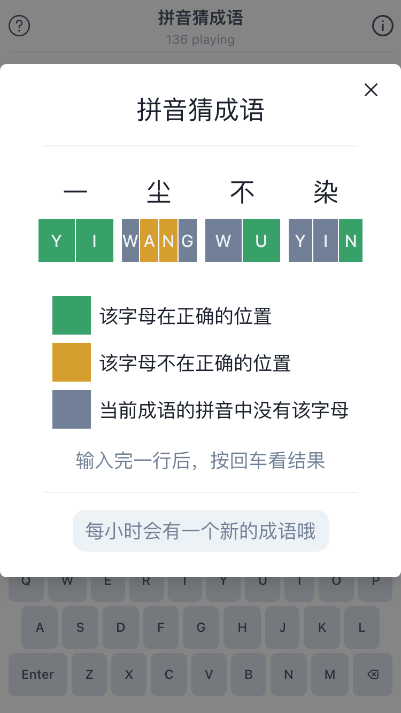

There’s already the very popular [拼音猜成语](https://pinyincaichengyu.com/) (Pīnyīn cāi chéngyǔ) made by [Li Zhong](https://limboy.me/), which uses [pinyin](https://en.wikipedia.org/wiki/Pinyin) input to guess Chinese idioms. It’s using the same QWERTY keyboard as Wordle, but with *more* than five letter tiles. It validates the words individually, generally the pinyin spelling *per* Chinese character, so you can’t just randomly type invalid pinyin and throw in all the vowels 😂.

I had a different idea.

Instead of constructing the pinyin to form an idiom, I feel that it would be better if there’s more focus on the Chinese characters themselves instead of alphabets.

JinGen [joked](https://twitter.com/jg_lim/status/1484506430711697412) that the hypothetical keyboard would be massive 🤣:

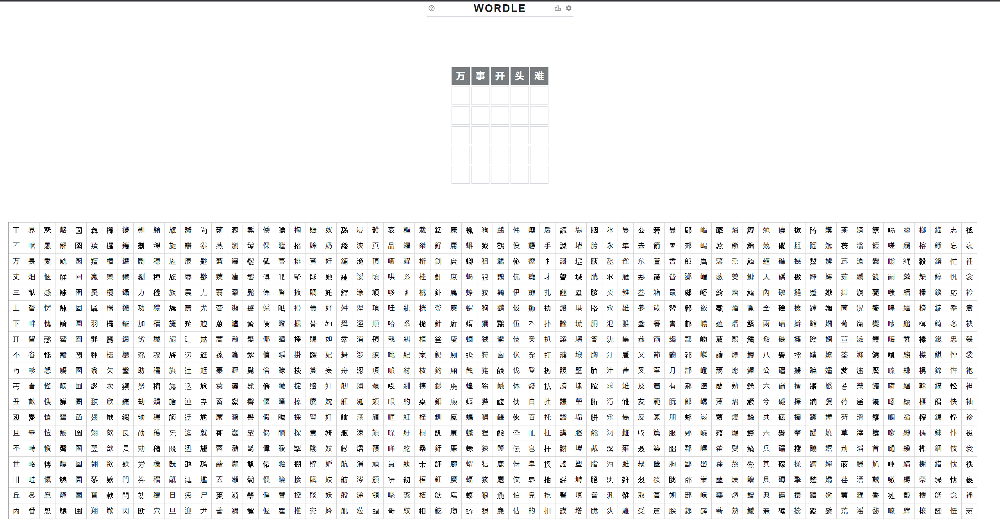

Of course, Chinese keyboards don’t really look like that. On iOS, there are two kinds; [pinyin keyboard and handwriting recognition](https://chinese.yabla.com/type-chinese-characters.php?platform=ios).

I don’t know, I find them too much work, just to play a game.

In Wordle, a player tap 5 keys to get a 5-letter word. For Chinese characters, a player need to tap quite a lot of keys just to form one character. For example, the word “pinyin” consists of 6 alphabetical letters to form 2 Chinese characters (拼音).

So I want one tap = one character. But JinGen’s mockup above is ridiculous.

I thought about this. 🤔

Instead of showing *all* characters like JinGen’s mockup, why not a subset of them? Maybe roughly 20 characters? (QWERTY keyboard has 26)

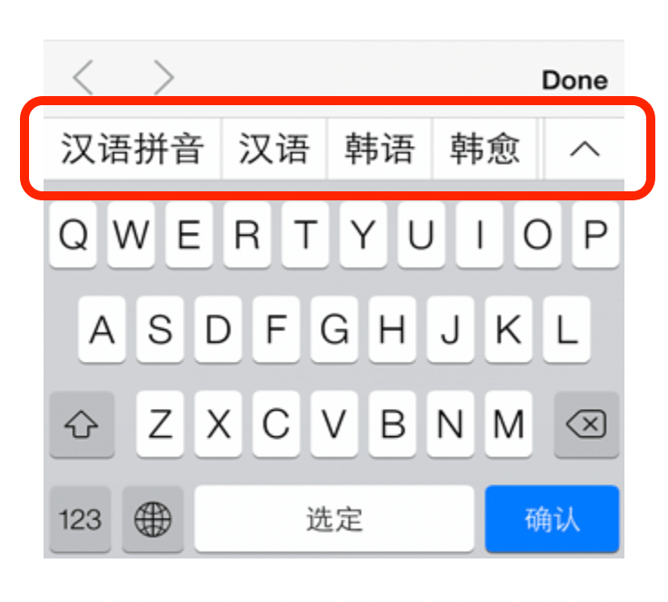

Instead of the full keyboard, why not emulate the suggestions a.k.a. Predictive Text at the top of the keyboard?

So for every idiom, I could generate a list of 20 characters. It’ll be minimum 20 characters and they could form a minimum of 6 idioms, because there are 6 chances. And it’s not just minimum 6 possible idioms, it’s minimum 6 possible “high-frequency” idioms, which could later form a few more “low-frequency” idioms.

At this point, I have no idea if this would work at all.

I coded it anyway 🤷‍♂️.

The [first prototype](https://twitter.com/cheeaun/status/1484482726644183041) looks like this:

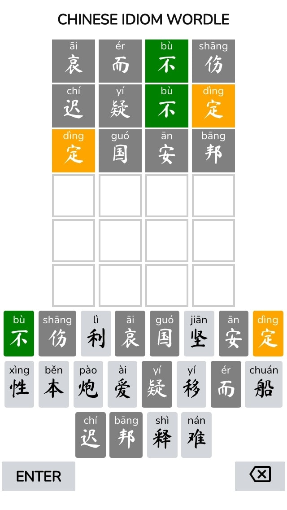

Not bad.

I use the [HTML `ruby` annotation element](https://developer.mozilla.org/en-US/docs/Web/HTML/Element/ruby) to display the pinyin above the Chinese characters. The specifications may have changed slightly but [Hui Jing has explained them in depth](https://chenhuijing.com/blog/html-ruby/).

Later on, I [found](https://twitter.com/cheeaun/status/1484717109100032005) that I’m not the first person who came up with this idea. There’s another [Android-based game](http://www.ddooo.com/softdown/44315.htm) that shows a list of characters as the keyboard:

](../images/screenshots/software/fengkuang-cai-chengyu-anzhuo-ban-crazy-guess-idioms-android.jpg)

It has 24 keys and even has an image illustration as hints 🤯.

That’s quite impressive if the game really has illustrations for *every* idiom. I mean, imagine hiring an artist drawing hints for all thousands of idioms 🤯.

Anyway, I wasn’t deterred from this and decided to keep going with my implementation.

Adapting to the viewports
---

Wordle is actually responsive for different viewport dimensions.

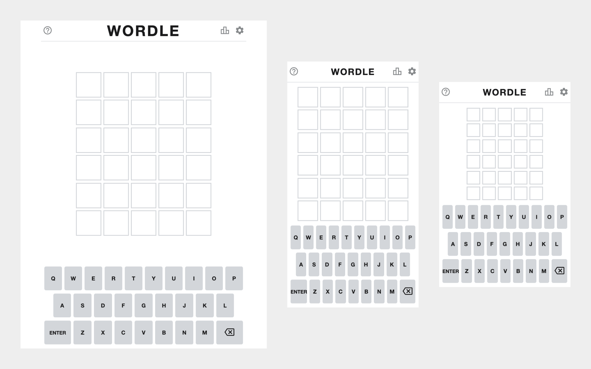

- The letter tiles will shrink in smaller viewports.
- The letter tiles will grow in larger viewports, but there’s a maximum width and height, so that the letters won’t be too big.
- The keyboard will *not* shrink in smaller viewports because it’s where people type. No one likes small keypads.
- The keyboard will grow in larger viewports but there’s a maximum width and height too.
- In larger viewports, the keyboard will always stick to the bottom and there’ll be blank spaces *around* the letters board.

Wordle uses a combination of CSS Flexbox and JavaScript code for this magic.

I manage to [re-implement](https://twitter.com/cheeaun/status/1484869992483295232) this, with pure CSS.

<video controls src="../videos/web/chengyu-wordle-responsive-layout.mp4"></video>

Few tricks were used such as the [`aspect-ratio` CSS property](https://developer.mozilla.org/en-US/docs/Web/CSS/aspect-ratio) combined with `max-height` on the tile rows.

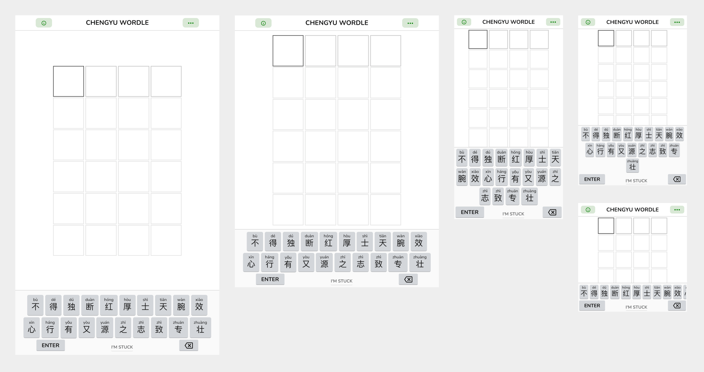

Unlike Wordle, the keyboard doesn’t need to be exactly 3 rows or match how a software keyboard looks like on mobile operating systems. In even smaller viewports, with smaller heights, the keyboard becomes a one-liner and horizontally scrollable!

Crazily enough, it even [works on](https://twitter.com/llun/status/1489498893452668935) [Apple Watch](https://www.llun.me/posts/dev/2022-02-05-apple-watch-browser/)! 🤯

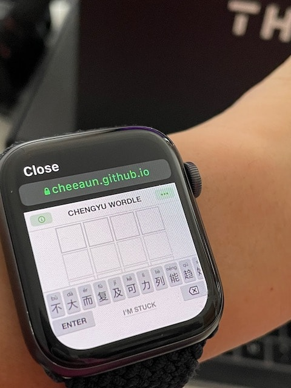

Keyboard shortcuts
---

Despite showing a software keyboard, Wordle also works with the hardware keyboard, which is usually meant for desktop players.

I think there are some Chinese (hardware) keyboards out there but I’ve never used them. I always use my Macbook’s QWERTY keyboard.

I [added](https://twitter.com/cheeaun/status/1485254481348816897) some basic keyboard shortcuts.

<video controls src="../videos/web/chengyu-wordle-keyboard-shortcuts.mp4"></video>

Pressing a letter will match the first letter of the pinyin. For example, pressing ‘Q’ will choose ‘qián’.

If the letter has many matches, pressing right or left arrow will cycle through them. For example, for ‘J’, the arrow keys will cycle through ‘jiàn’ ‘jìn’ and ‘jīng’.

Pretty neat.

Beta testing
---

Since I have no idea if this would work at all, I [asked around](https://twitter.com/cheeaun/status/1485981757644353539) for people to help beta test the game.

Surprisingly feedback has been quite interesting. Somehow the game becomes either *too easy* or *too difficult* for the players. There’s hardly a middle ground here 😅. So it’s either the players knows a large vocabulary of idioms or just one or two of them 😂.

Along the testing period, there were some *small* issues.

## Pinyin

Pinyin for some characters were wrong. My initial attempt was quite hacky, so I solved it by using the whole [`pinyin`](https://github.com/hotoo/pinyin) library, currently maintained by [hotoo (闲耘™)](https://github.com/hotoo).

I was honestly surprised that pinyin mapping doesn’t work one-to-one, but one-to-many. 🤔

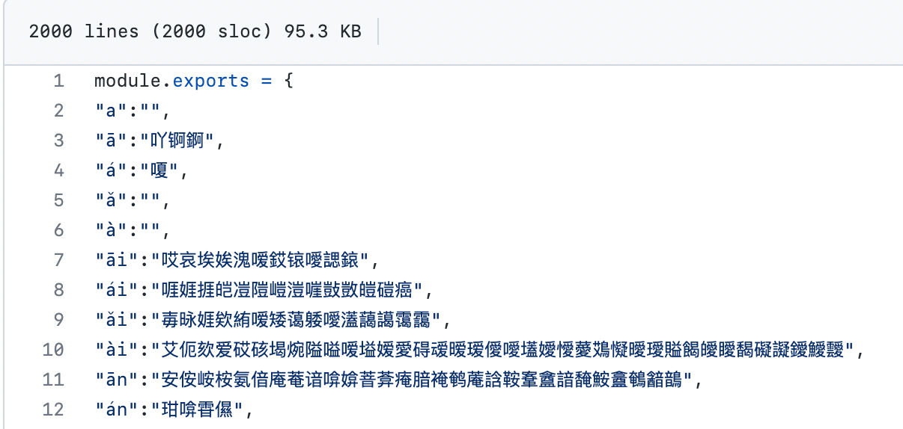

However, more than a week later, someone reported a bug to me:

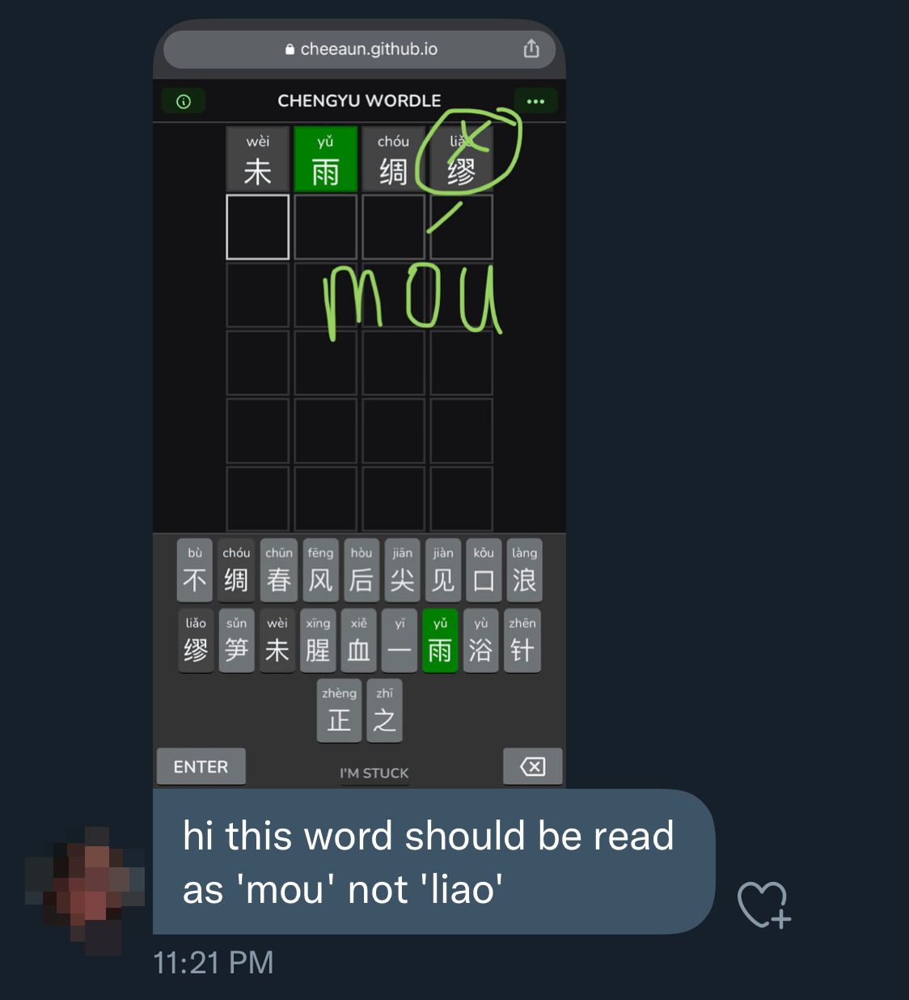

I was quite surprised to see this and turns out, this is **heteronym**.

Some Chinese characters are spelled and written the same way, but pronounced differently based on certain context.

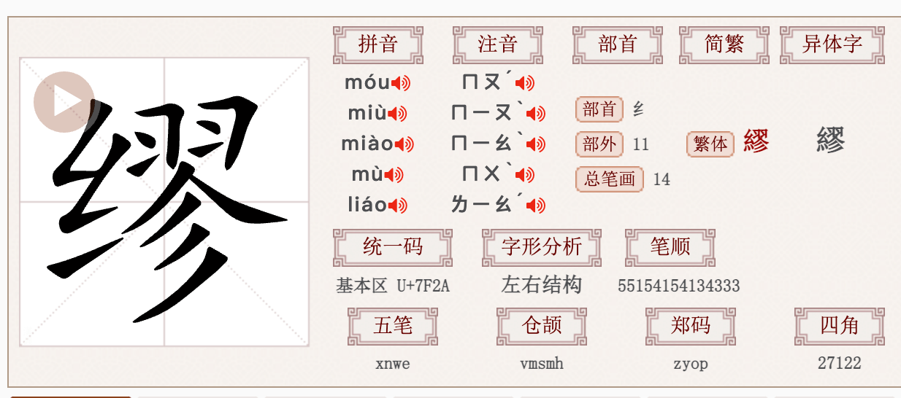

I looked again at the [documentation for `pinyin` package](https://github.com/hotoo/pinyin) and realised that it serves a different dictionary for the web version compared to its Node version. The web version is *simpler* and smaller in file size. The author encourages that this pinyin conversion should be done in the back-end instead of front-end 🤔.

Hmm, for this game, I don’t plan to do this on the server-side though.

So I tried a few ways to somehow *force* the library to use the Node version but to no avail. I ended up using a different library called [`pinyin-pro`](https://github.com/zh-lx/pinyin-pro), currently maintained by [Zhou Li Xiang](https://zlxiang.com/). It seems to have the whole dictionary and able to handle heteronyms too!

After some testing and [a bug fix](https://github.com/zh-lx/pinyin-pro/issues/43), I manage to implement a pretty good implementation of a multiple-pinyin interface.

The pinyin shown on the keyboard will be based on the whole idiom context instead of per-character.

Technically, `pinyin('缪')` returns `mù` (from `pinyin-pro` library) or `liáo` (from the previous `pinyin` library). But `pinyin('未雨绸缪')` *should* correctly return `wèi yǔ chóu móu` (notice that it’s `móu` now). So the pinyin on the keyboard should show `móu`.

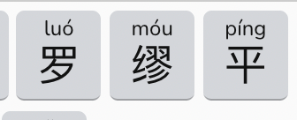

But for some games, it’s possible that one character exhibits different pronunciations for different idioms. An example would be the character ‘**恶**‘ in the idioms 恶性循环 (**è** xìng xún huán) and 痛深恶绝 (tòng shēn **wù** jué). In this special case, the keyboard will show *both* pinyins.

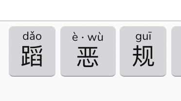

Then what happens to the pinyin on the game tiles? Well, they’ll dynamically change based on the whole constructed idiom as-you-type! 🤯

<video controls src="../videos/web/chengyu-wordle-heteronym-support.mp4"></video>

## Idiom definitions

I added an extra link that points to the definition or explanation of the hidden idiom. They will be shown in the results dialog when a player won or lost the game.

The first candidate was [CC-CEDICT](https://cc-cedict.org/editor/editor.php?handler=Main). It’s [a project](https://cc-cedict.org/wiki/) to create an online, downloadable public-domain Chinese-English dictionary.

[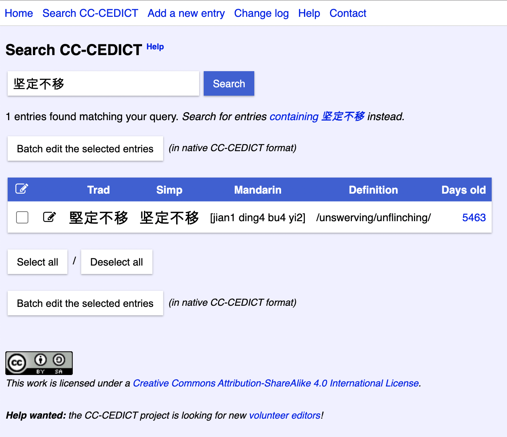](https://cc-cedict.org/editor/editor.php?handler=QueryDictionary&querydictionary_search=%E5%9D%9A%E5%AE%9A%E4%B8%8D%E7%A7%BB)

Unfortunately, it doesn’t seem to have *all* the idiom entries, and mostly return not-found results 😢.

Then, one of the testers found [Baidu Hanyu (百度汉语)](https://hanyu.baidu.com/).

[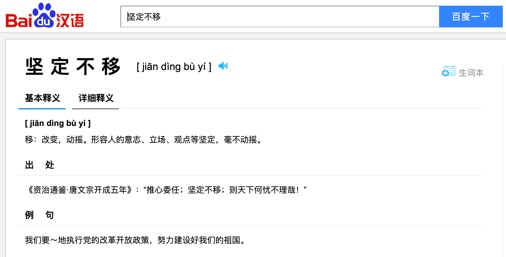](https://hanyu.baidu.com/s?wd=%E5%9D%9A%E5%AE%9A%E4%B8%8D%E7%A7%BB)

Seems better, but some idiom entries were missing too 😅.

Then, I found [ZDIC](https://www.zdic.net/) from [Li Zhong’s tweet](https://twitter.com/_limboy/status/1487769444541931521), as he’s also adding idiom definitions on [pinyincaichengyu.com](https://pinyincaichengyu.com/).

[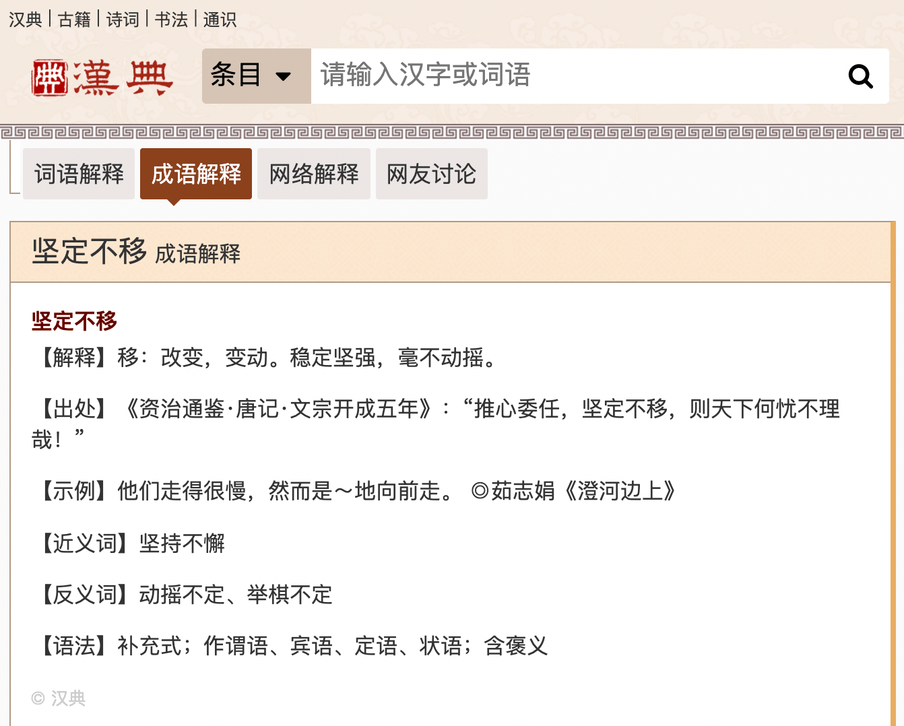](https://www.zdic.net/hans/%E5%9D%9A%E5%AE%9A%E4%B8%8D%E7%A7%BB)

In the end, I use both Baidu and ZDIC links for the sake of completeness.

I’ve even included the definitions into the game itself.

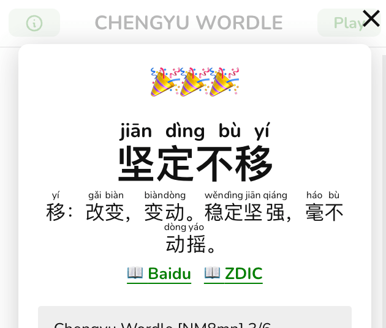

## Chinese font

During the beta test period, the game uses the [Ma Shan Zheng font](https://fonts.google.com/specimen/Ma+Shan+Zheng) from Google Fonts. It looks pretty nice.

One of the testers found a bug:

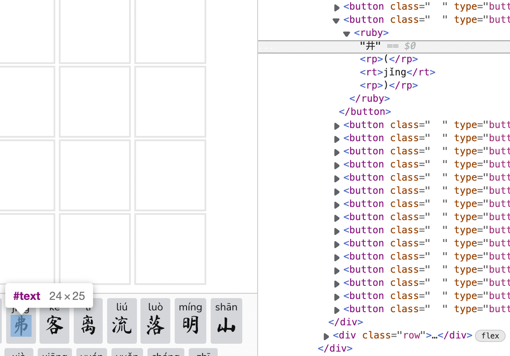

The character “丼” is rendered as “弗”?!?

This is *really* weird. It’s probably due to the font not supporting all glyphs, so I researched a little and found that it’s *really* difficult to find a good custom (and free) Chinese font. Even when I found one, the web font file sizes are seriously **huge**! 😅

There are some very detailed articles on this:

- [Chinese Standard Web Fonts: A Guide to CSS Font Family Declarations for Web Design in Simplified Chinese](http://kendraschaefer.com/2012/06/chinese-standard-web-fonts-the-ultimate-guide-to-css-font-family-declarations-for-web-design-in-simplified-chinese/)
- [The Complete Beginner’s Guide to Chinese Fonts](https://webdesign.tutsplus.com/articles/the-complete-beginners-guide-to-chinese-fonts--cms-23444)
- [5 High Quality Chinese Webfont services for your next Chinese web project](https://minitheory.com/2015/04/06/5-high-quality-chinese-webfont-services-for-your-next-chinese-web-project/)

As a quick fix, I removed the font. Will probably revisit this later.

## Start date for daily idioms

On the original Wordle, a new word is available every day. It’s not timezone-specific and actually relies on the user’s device timezone (local timezone).

This is an interesting thought. Timezone specificity is not important here for this game, unlike an app or a web product. All players can start playing the next new word around the clock instead of everyone around the globe waiting for that specific hour in the day, which could be 4AM or something. It might seem “unfair” for some players that some could play a new word *earlier* than players in the other timezone, but it doesn’t really matter as long as players only post the results without spoilers. For the more technical folks, they could actually skip to next day or any days by changing their operating system’s clock 😆.

From the implementation side, it could be a list of words and every word is assigned to specific dates. The question is how are they assigned? Off the top of my head, I think that the first day of the year could be the first word, 2nd day is the 2nd word and so on, but that means it’s limited to 365 words (year 2022)? Should it overflow to next year, so 1st January 2023 will serve the 366th word?

During the time when I build Chengyu Wordle, it’s already a few days after 1st January 2022, so setting the first idiom to day 1 would mean no one will be able to play it 😅.

My curiosity lead to digging in the code in Wordle.

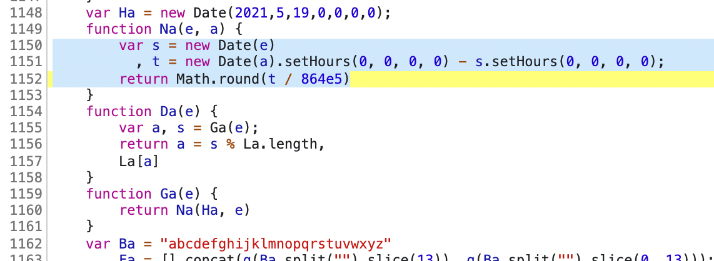

Aha! The variable `Ha` is a hard-coded start date! It’s **19 June 2021**! (Months are zero-indexed in JavaScript)

```javascript
function Na(e, a) {
  var s = new Date(e)
    , t = newDate(a).setHours(0, 0, 0, 0) - s.setHours(0, 0, 0, 0);
  return Math.round(t / 864e5)
}
```

There’s another function `Na` that accepts two date values, which are supposedly the start date and today’s date, and returns the index. So if today’s date is 19 June 2021, it returns 0 (first word). 20 June 2021 returns 1 (second word) and so on.

```javascript
function Da(e) {
  var a, s = Ga(e);
  return a = s % La.length,
  La[a]
}
```

The next function `Da` is a surprising find for me. It will cycle back to 0 once the index reaches the last word of the list. For example, if the game has a list of 100 words, what happens on the 101st day? Well, this logic will serve back the first word!

I think this is a pretty neat solution. It solves the problem of what if you’ve missed the last few days of words and thought that you can’t play them anymore. Once the list of words is exhausted, you’ll go back to the beginning of the list again ♻️.

For Chengyu Wordle, it started *without* this daily game feature. To compensate, I added a button that allows players to play a random idiom. Few days after testing, I added this daily game feature and set day 1 to **27 January 2022**.

Mathematically speaking, with 8000+ idioms in Chengyu Wordle, if a player plays one idiom per day, it’ll **take more than 21 years to finish all the idioms**. 🤯

Evaluation rules
---

Guessing words on Wordle will show the letters in coloured tiles.

- Green = The letter is in the word and in the correct spot.
- Yellow = The letter is in the word but in the wrong spot.
- Gray = The letter is not in the word in any spot.

They might look simple at first, but oh boy, almost [everyone](https://news.ycombinator.com/item?id=30174386) [fell](https://news.ycombinator.com/item?id=30233600) [into](https://news.ycombinator.com/item?id=30086083) [this](https://news.ycombinator.com/item?id=29947881) [trap](https://news.ycombinator.com/item?id=30103848).

It’s explained in this page written by Alex Selby: [The best strategies for Wordle](http://sonorouschocolate.com/notes/index.php?title=The_best_strategies_for_Wordle):

> I *think* the colour scoring rules work like this, but would be happy to be corrected.
>
> Let's refer to your guess as *testword*, and the secret word as *hiddenword*. Then I believe the scoring rules are these:
>
> - First determine all greens, and cross out these letters in *testword* and *hiddenword*.
> - Then from left to right in *testword* see which letters correspond to a letter in *hiddenword*. If you find one, then it's a yellow, but you need to cross it off in *hiddenword*.
> - Remaining positions are scored as black.
>
> The second point means that you can't reuse letters in *hiddenword*, so for example the total number of green 'T's and yellow 'T's in *testword* can't exceed the number of 'T's in *hiddenword*.
>
> So if *hiddenword* is **HOTEL** then the *testword* **SILLY** would score **BBYBB**: the second 'L' does not score because only one 'L' can, and the earlier one takes precendence.
>
> But if *hiddenword* were **DAILY** then the same *testword* **SILLY** would score **BYBGG**. This time it's the first 'L' that doesn't score, because even though it is earlier than the 'L' in fourth position, greens take priority over yellows.

**The trap lies in repeated letters in a word.**

Instead of just a single loop to mark which letter is green or yellow, the logic needs to keep track of repeated letters, loop through again and either mark some letters yellow or not.

Initially my code handled the above cases and I was quite proud. Until someone reported another bug:

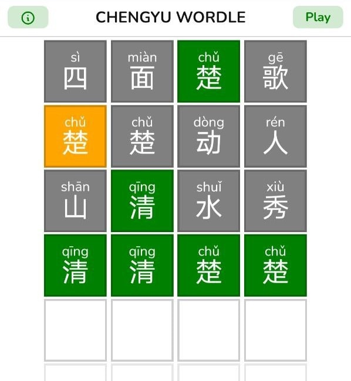

On the second row, both of the character “楚” (chǔ) should be in yellow because the hidden idiom is 清清楚楚 (qīng qīng chǔ chǔ)!

I was quite dumbfounded, got fed up and [started writing tests](https://twitter.com/cheeaun/status/1490329731958734848).

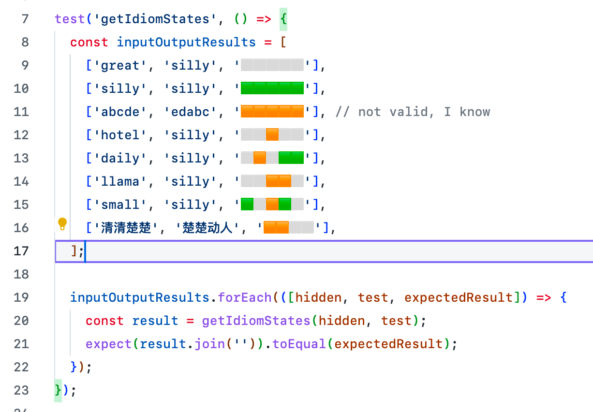

My logic fails when there are repeated letters in **both** the *testword* and *hiddenword*. And now with this tests, this will finally be fixed once and for all!

Finishing touches
---


It’s almost done, and I added a little sprinkle of finishing touches to the game:

- **[Metacrap](https://adactio.com/journal/9881)**: All the titles, descriptions, icons and social media preview images.
- **Idiom IDs**: Besides allowing players to play a random idiom, each idiom is also assigned its own unique ID that’s shareable. So if someone shares the results, a link below the results will include the ID that goes to this exact idiom instead of the idiom of the day.
- **Hints**: I added a “I’m stuck” button at the bottom of the keyboard, after seeing some folks struggled hard at the game. Every time it’s tapped, it’ll show a different hint. Technically, the hints should be good enough to be unstuck. 😉
- **Hard mode**: While some players are having a hard time playing the game, some actually think that it’s *too easy*. So, I introduced “[Hard mode](https://twitter.com/cheeaun/status/1491353605747908611)”, which works a bit differently than Wordle’s. In Wordle’s “Hard mode”, any revealed hints must be used in subsequent guesses. In Chengyu Wordle, the number of keys increase from minimum 20 to 40, thus increasing the number of possible idiom guesses in a game.
- **Localisation**: The game is available in both English and Simplified Chinese. The strings for Simplified Chinese were hastily translated via Google Translate, so help is pretty much needed. 🙏
- **Old browsers support**: I use [Vite](https://vitejs.dev/) to bundle the code and needed to use [@vitejs/plugin-legacy](https://github.com/vitejs/vite/tree/main/packages/plugin-legacy) to create production builds for legacy browsers. For some reason, there are **a lot** of folks using *really* old Android phones with old browsers, as the errors are tracked via [Bugsnag](https://www.bugsnag.com/).
- **Analytics**: I took this chance to try a few privacy-friendly analytics like [Panelbear](https://panelbear.com/), [Pirsch](https://pirsch.io/) and [Plausible](https://plausible.io/). In the end, I end up using Plausible for its better user interface and features.

The launch
---


I officially launched [Chengyu Wordle](https://cheeaun.github.io/chengyu-wordle/) on [27 January 2022](https://twitter.com/cheeaun/status/1486655277516480527), just one week after my [first tweet](https://twitter.com/cheeaun/status/1484482726644183041) and 4 days before Chinese New Year! 🚀

It’s [open-sourced on GitHub](https://github.com/cheeaun/chengyu-wordle), with complete documentation on the dataset, technical setup and localisation files.

I’ve also made sure to attribute to other similar attempts by other talented folks!

- [猜成语 (Cāi chéngyǔ)](https://bryony.dev/chengyu/chengyu.html) by [@nurupo_dev](https://twitter.com/nurupo_dev)
- [拼成语 | Chinese Wordle](https://allanchain.github.io/chinese-wordle/) by [Allan Chain](https://allanchain.github.io/blog/)
- [拼音猜成语 (Pīnyīn cāi chéngyǔ)](https://pinyincaichengyu.com/) by [Li Zhong](https://limboy.me/)
- [汉兜 (Hàn dōu)](https://handle.antfu.me/) by [Anthony](https://twitter.com/antfu7) & [Inès](https://twitter.com/iiiiiiines_____) (Another popular one!)
- [Telegram @unofficial_wordle_bot](https://t.me/unofficial_wordle_bot) by [Oh Chin Yang](https://www.facebook.com/iamohcy)

Few days later, I [made a pull request](https://twitter.com/cheeaun/status/1487275289516265475) for Chengyu Wordle to be added to [**Wordles of the World**](https://rwmpelstilzchen.gitlab.io/wordles/), the most comprehensive list of Wordle-like games and resources online.

Later on, I added [dark mode](https://twitter.com/cheeaun/status/1487766797994455044) and made this pretty cool 3D-looking mock with [Morflax Things](https://morflax.com/things).


Chengyu Wordle got a quite few media coverage too! Some are *very* small mentions while some are quite prominent 😎.

- 30 Jan 2022: [6種英文和中文的 Wordle 猜字遊戲 打發時間真好用](https://blog.user.today/wordle-games-gallery/)
- 30 Jan 2022: **Sixth Tone** - [Wordle-Like Games Slowly Gain Traction on Chinese Social Media](https://www.sixthtone.com/news/1009586/wordle-like-games-slowly-gain-traction-on-chinese-social-media-)
- 2 Feb 2022: **Kotaku** - [A Sensational Wordle Clone Without Any Actual Words](https://kotaku.com/games-like-wordle-subwaydle-nyct-mta-best-routes-1848461481)
- 4 Feb 2022: **8world Entertainment Lifestyle** - [全世界都在Wordle！快试试数字版Nerdle](https://entlife.8world.com/life/nerdle-nerdle-is-a-new-maths-based-wordle-clone-1718676)
- 4 Feb 2022: **Mothership** - [PM Lee says Wordle a fun way to keep the mind engaged, recommends Chinese & Malay versions](https://mothership.sg/2022/02/pm-lee-says-wordle-a-fun-way-to-keep-the-mind-engaged-recommends-chinese-malay-versions/)
- 6 Feb 2022: **新加坡眼** [这款小游戏风靡全球，让李显龙总理都“玩上瘾了”](https://www.yan.sg/lixinglongzholi/)
- 10 Feb 2022: **AsiaOne** - [Want more Wordle? Here are 13 spin-offs to try, including a Singlish version](https://www.asiaone.com/lifestyle/want-more-wordle-here-are-13-spin-offs-try-including-singlish-version)
- 11 Feb 2022: **红蚂蚁** [连总理都推荐的爆红猜字游戏Wordle　为何在全球疯狂吸粉？](https://www.redants.sg/good-reads/story20220211-5941)

Honestly I haven't felt so excited in a long while!

The **craziest ever mention** has got to be [this](https://www.facebook.com/leehsienloong/posts/484183366401131):

[![Facebook post by Lee Hsien Loong, with the content “Many Singaporeans have joined in the fun of playing Wordle - an online word puzzle game, where the goal is to guess a five-letter word within six tries. This game has become such a viral sensation that it was recently purchased by The New York Times. I’ve even noticed some ministries and agencies using the green, yellow and grey squares to liven up government messaging! I was pleasantly surprised to find out that there are Chinese and Malay versions of the game. Give it a go – a simple but fun way to keep the mind engaged. Original https://www.powerlanguage.co.uk/wordle/ Chinese: https://cheeaun.github.io/chengyu-wordle/ Malay: https://www.projecteugene.com/katapat.html – LHL”](../images/screenshots/web/facebook-post-lee-hsien-loong-chengyu-wordle@2x.png)](https://www.facebook.com/leehsienloong/posts/484183366401131)

On 3 February 2022, The Prime Minister of Singapore, [Lee Hsien Loong](https://en.wikipedia.org/wiki/Lee_Hsien_Loong), [made a post on Facebook](https://www.facebook.com/leehsienloong/posts/484183366401131), talked about how Singaporeans have joined in the fun of playing Wordle, linked to [BBC’s article](https://www.bbc.com/news/business-60208463), and mentioned the original Wordle, the Chinese version (mine) and the [Malay](https://www.projecteugene.com/katapat.html) version! 🤯🤯🤯

When this happened, I was just finishing up my dinner and got quite a bunch of notifications from friends tagging me and congratulating me 😅.

Traffic shot up, from 7,000 visitors to 15,000 on the day itself and grew to 25,000 on the next day! 📈


Learnings
---

[](https://twitter.com/cheeaun/status/1491749802023202816)

I have a lot of fun building this game.

From trying to reverse engineer the mechanics of Wordle, to listening to how [Josh Wardle made a prototype](https://youtu.be/X_e2IEaR4aA?t=1019) back in 2013. Instead of rebuilding the exact same clone, somehow I tried to build a different variant of it, with its own set of challenges that I didn’t know much about. I spent a lot of time polishing every single detail while trying to preserve the whole unobtrusive nature of Wordle. Perhaps similar to the original author, I did not expect this to become huge at all, though mine is still smaller scale compared to the original Wordle.

By building a variant of Wordle, I felt like I’m part of [a whole family of developers](https://rwmpelstilzchen.gitlab.io/wordles/) who have done the same thing and experienced the same thing as I do. The author of [Subwaydle](https://www.subwaydle.com/) [mentioned](https://kotaku.com/games-like-wordle-subwaydle-nyct-mta-best-routes-1848461481) that he came across Chengyu Wordle and [Nerdle](https://nerdlegame.com/) which made him wanting to make his own.

I see a lot of people posting their Chengyu Wordle results on Twitter and Facebook, *together* with their Wordle results. On Facebook, I saw a woman [posting](https://www.facebook.com/TCKoays/posts/1185534145184481) about playing Chengyu Wordle and it took her 3 kids on dictionaries, 4 clues, 45 minutes and a translation to traditional Chinese to solve their first play. Even a teacher [replied](https://www.linkedin.com/feed/update/urn:li:activity:6893768924618473472?commentUrn=urn%3Ali%3Acomment%3A%28activity%3A6893768924618473472%2C6896231288982917120%29) to me that the game is very popular among teachers, very well received and shared among their Facebook groups.

This is not the first time I create a web game. Chengyu Wordle is the third one after my first web game, [Pentagoo](https://github.com/cheeaun/pentagoo) and second game, [Bubble Wrap](https://github.com/cheeaun/bubble-wrap). Both didn’t get popular but were very fun to build too. They gave me some good foundation on how to build games, though the funny thing is I’m actually not very good in playing them. 🤣

Yeah, I built Chengyu Wordle, but I can’t play it because I can't actually read or write Chinese 😅. I can speak Mandarin though, and the pinyin was actually to help *me*, which in turn help others too. 🤷‍♂️

But heck, who cares, building a game is fun!

All of this happens within just **two weeks**.

Wow, what a ride.