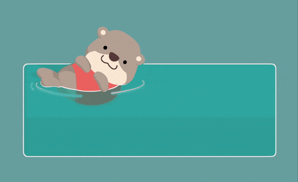

# 2022 in review

Wow, another year has passed. And now another review.

It's time for *the* list, that I usually compile monthly for my newsletter.

**January**

- [Scraped](https://twitter.com/cheeaun/status/1477919978191949826) a bunch of taxi stands 🚕
- Ordered & printed [misbrands](https://twitter.com/cheeaun/status/1478249439613493249) stickers 👾
- [Experimented](https://twitter.com/cheeaun/status/1478911115249664001) with a 3D globe 🌏
- [Made a repo](https://twitter.com/cheeaun/status/1480148673472303106) that scrapes what's happening in SG 🇸🇬
- Got another [free mask](https://twitter.com/cheeaun/status/1480521200799387648) from vending machine 😷
- Revived [one of my (very) old projects](https://twitter.com/cheeaun/status/1481602832231206922) 🏔️
- [Light to night](https://twitter.com/cheeaun/status/1482721291371450368) festival 🌝
- Did a [CSS Speedrun™️](https://twitter.com/cheeaun/status/1483011049519710211) 🏃‍♂️
- Launched [my own variant of Wordle](https://twitter.com/cheeaun/status/1486655277516480527)! 🚀

**February**

- Made a [3D model of Wordle results with Spline](https://twitter.com/cheeaun/status/1491749802023202816) 📦
- Blogged: [Chengyu Wordle Is Not a Love Story](/blog/2022/02/chengyu-wordle-is-not-a-love-story/) 📝
- Had a [night walk](https://twitter.com/cheeaun/status/1495057584256012289) 🚶
- [2️⃣2️⃣0️⃣2️⃣2️⃣0️⃣2️⃣2️⃣](https://twitter.com/cheeaun/status/1495790421322129411)
- Built [a Cloudflare worker](https://twitter.com/cheeaun/status/1497756369541210121) 👷‍♀️

**March**

- Reported [a bug](https://twitter.com/cheeaun/status/1498704027877777409) to MDN and it got [fixed](https://twitter.com/cheeaun/status/1505491409562116100). 🌓
- Another [night walk](https://twitter.com/cheeaun/status/1502668058770350084) 🚶
- Tested iOS 15.4's [Face ID unlock *with a mask*](https://twitter.com/cheeaun/status/1503572368475639810) 😷
- Showed [a sneak peek](https://twitter.com/cheeaun/status/1505510267509043202) of my new map web app designed for walking. 🗺️
- Got [interviewed](https://twitter.com/cheeaun/status/1506876978041098246). 🗣️
- My blog post [got linked from Slate](https://twitter.com/cheeaun/status/1508332113275518979).

**April**

- 🚶 [Night walk](https://twitter.com/cheeaun/status/1510278670568501248).
- 🚶 [Afternoon walk](https://twitter.com/cheeaun/status/1510531609514033155).
- 🔗 Got another [link-in-bio](https://twitter.com/cheeaun/status/1512744603421601793) page.
- ✌️ Made [2 big changes](https://twitter.com/cheeaun/status/1513069547569676288) to checkweather.sg.
- 💬 Started [a new Telegram chat group](https://twitter.com/cheeaun/status/1513500939444912128).
- ©️ Found a [cool font](https://twitter.com/cheeaun/status/1514286125182971905).
- 🤢 [Gastric week](https://twitter.com/cheeaun/status/1515157674316349449).
- 🪜 Ranted about [ladders](https://twitter.com/cheeaun/status/1514565947884924937).
- 🚶 Night walk [again](https://twitter.com/cheeaun/status/1517141144295018498).
- 👾 Bought [MRT/LRT stickers](https://twitter.com/cheeaun/status/1517157741034319873) from a Redditor!
- 🍎 Ranted about [Apple Store on different maps](https://twitter.com/cheeaun/status/1517414101017788416).
- 💰 [Sponsored](https://twitter.com/cheeaun/status/1519155214732783616) devs on GitHub Sponsors.
- 💸 [Subscribed to MDN Plus 5](https://twitter.com/cheeaun/status/1519923906005528576).

**May**

- 🆒 Made [pretty cool updates](https://twitter.com/cheeaun/status/1521123550723285008) to my HackerWeb iOS app.
- 🔎 Discovered that [SEO for Chengyu Wordle](https://twitter.com/cheeaun/status/1522608987564560384) became really weird
- ☕ Received [5 coffees](https://twitter.com/cheeaun/status/1523691180852097024).
- 🃏 Made a [joke](https://twitter.com/cheeaun/status/1523888447039045632).
- 🔊 Got [mentioned in /r/programmerhumor](https://twitter.com/cheeaun/status/1524988280944488448)
- 🌏 Finally using [globe projection on my cheeaun.earth](https://twitter.com/cheeaun/status/1525346727125209088)
- 💅 Spruced up [my projects page](https://twitter.com/cheeaun/status/1526962826187010048)
- ➕ [Tough week(s)](https://twitter.com/cheeaun/status/1527604392022593537)
- 🍛 First time saw [Uncle Roger mentioned on HN](https://twitter.com/cheeaun/status/1528560755398037504)
- 🆓 Got [a free .dev domain](https://twitter.com/cheeaun/status/1527873622949658625) and made [a Cloudflare worker](https://twitter.com/cheeaun/status/1528747046962077696)

**June**

- 📲 Trying out [iOS 16 beta](https://twitter.com/cheeaun/status/1534042657168580608).
- 🤔 Made a [Spiral Emoji Wallpaper Generator](https://twitter.com/cheeaun/status/1534867432887951365) ← this went viral!
- 🚀 Released [Hackerweb for iOS v2.1.0](https://twitter.com/cheeaun/status/1536914467048796160).
- 🏨 Had [1-week staycation](https://twitter.com/cheeaun/status/1541293270847762432).

**July**

- 🗣 [Mentioned](https://twitter.com/cheeaun/status/1544943757174636545) some realities of front-end.
- 💻 [Ordered](https://twitter.com/cheeaun/status/1545384138873507845) Macbook Air M2. [Got it](https://twitter.com/cheeaun/status/1553339507717525504).
- 👾 Restocked [stickers](https://twitter.com/cheeaun/status/1547101020504788992).
- 📲 Tested [some cool wallpapers](https://twitter.com/cheeaun/status/1547460681724637184) on iOS 16 beta.
- 👯 [Attended](https://twitter.com/cheeaun/status/1552838834328457217) an in-person conference.
- 🥘 [Co-organized](https://twitter.com/cheeaun/status/1553326753472360448) Geek Brunch SG.

**August**

- 📹 [Made](https://twitter.com/cheeaun/status/1554072421296066561) a viral [TikTok](https://www.tiktok.com/@cheeauntok/video/7126872546745584898).
- 🗺️ Made a new [map viz for Singapore Night Festival](https://twitter.com/cheeaun/status/1561624324124975104).
- 👾 Got [new stickers!](https://twitter.com/cheeaun/status/1562103821840502784)

**September**

- 👀 Saw [Uncle Raymond](https://twitter.com/cheeaun/status/1565946352080523266), a [TikTok sensation](https://www.channelnewsasia.com/singapore/uncle-raymond-tiktok-dancing-video-singapore-2751001).
- 💸 Bought [a lot of stickers](https://twitter.com/cheeaun/status/1566301550695239682).
- 🤑 [Sold](https://twitter.com/cheeaun/status/1570676999131377665) my Macbook Air (M1) because I got the new M2 now.
- 💰 Almost got [scammed](https://twitter.com/cheeaun/status/1571879690658525184).
- 🎧 Got my new [Airpods Pro 2nd generation](https://twitter.com/cheeaun/status/1573242192365293569).
- 🥺 Finally [3 meetups](https://twitter.com/cheeaun/status/1575117325069451264) in one day (like pre-covid times).

**October**

- 📦 Made a few 3D logos… [1](https://twitter.com/cheeaun/status/1577254662834561027) [2](https://twitter.com/cheeaun/status/1578219364091719680) [3](https://twitter.com/cheeaun/status/1578400619601096704) [4](https://twitter.com/cheeaun/status/1578566280998580225) [5](https://twitter.com/cheeaun/status/1578693407144554497) [6](https://twitter.com/cheeaun/status/1578950142182363136) [7](https://twitter.com/cheeaun/status/1579414342943924224)
- 📱 Started using a new pretty nice [Lock Screen wallpaper](https://twitter.com/cheeaun/status/1579285794623467521).
- 🎟️ Attended [ViteConf](https://twitter.com/cheeaun/status/1579852745812869120) online.
- 🦦 [Designed](https://www.reddit.com/r/singapore/comments/y55n45/i_made_a_3d_model_of_tracetogether_otter/) another [3D mascot](https://twitter.com/cheeaun/status/1581267045240295424).
- 🎨 Designed yet another [3D mascot](https://twitter.com/cheeaun/status/1583785195668328449).
- 🆙 [Upgraded](https://twitter.com/cheeaun/status/1584712248651837440) to macOS Ventura and iOS 16.1.
- 🌞 Got a free [TEL3 sunshade pouch](https://twitter.com/cheeaun/status/1585119776895954944).
- 🤩 Tested the new [iOS16 Live Activities from CityMapper](https://twitter.com/cheeaun/status/1585143638845112320).
- ⛰️ Remade [3D models from Monument Valley level 1](https://twitter.com/cheeaun/status/1585627075477528576).
- 🎟️ [Attended](https://twitter.com/cheeaun/status/1586240578949242880) [Geekcamp](https://twitter.com/cheeaun/status/1586309722818256896).
- 🤚 Designed [a 3D hand](https://twitter.com/cheeaun/status/1586603224529707009).

**November**

- 📺 Got [a new YouTube handle](https://twitter.com/cheeaun/status/1587268513164451841).
- 😀 Designed [a 3D emoji](https://twitter.com/cheeaun/status/1587462133612130307).
- 🍰 Designed [UIlicious's logo in 3D](https://twitter.com/cheeaun/status/1587745777081729029).
- ⛳ Made [a 3D golf game](https://twitter.com/cheeaun/status/1588044067383803904).
- 🐘 Start using Mastodon [again](https://mastodon.social/@cheeaun/109295299882124302).
- ✨ Played with [Spline's Conditional Logic](https://twitter.com/cheeaun/status/1589573334102347777).
- 🚄 Visited [all 11 new stations in Thomson-East Coast line](https://twitter.com/cheeaun/status/1590970134633787394).
- 🚶 Had a [walk](https://twitter.com/cheeaun/status/1591832831378206720).
- 🚂 Updated [RailRouter.SG](https://twitter.com/cheeaun/status/1593545139602870272).
- 🚏 Made some UI updates for [bus stop 66271](https://twitter.com/cheeaun/status/1594990167261343745).
- 🗺️ Played [a little with Mapbox Tiling Service](https://twitter.com/cheeaun/status/1596847755074445314).
- 🏗️ Started [building something](https://twitter.com/cheeaun/status/1597613196734787584).

**December**

- 💯 Hit [100-day streak](https://twitter.com/cheeaun/status/1600296819418103809) on Product Hunt.
- 🚀 [Soft-launched](https://twitter.com/cheeaun/status/1603241907970519040) an alpha version of my Mastodon web client.
- 🌧️ [Set up a Mastodon bot account](https://twitter.com/cheeaun/status/1604441852513435649) for checkweather.sg.
- 🎁 [GitHub Unwrapped](https://twitter.com/cheeaun/status/1604855085737345029).
- 🦾 Got [access](https://twitter.com/cheeaun/status/1605226397131497472) to Notion AI.

## Work and unemployment

After working for almost 3 years with work-from-home and sometimes-work-from-office arrangement, it gets pretty tiring. The [first year](/blog/2020/12/2020-in-review) (2020) was cool as everyone starts to learn how to juggle things around. The [second year](/blog/2022/01/2021-in-review) became pretty distressing for me, especially when I got hospitalised (not due to that disease).

This year is supposedly better in many ways as it's almost "post-pandemic" with lesser restrictions, but the tiredness start to kick in for me. A lot of things happen, a lot of problems to be solved, a lot of uncertainties. Despite seeing other folks moving on with new plans ahead, I felt like I'm stuck. In this pandemic or post-pandemic sense, I feel like I'm still in 2020. In the career side of things, I feel like I've been stuck for more than 10 years.

On April, I [tweeted](https://twitter.com/cheeaun/status/1514565947884924937):

> Been working for 16 years (first web dev job, excluding my part-time freelance work while schooling) Seems like my career ladder has been flat for the past 10 years. Maybe my approach has been wrong all the while.

There's a few good replies, though sadly some were like "me too" answers 😢.

On July, I posted [this on Hacker News](https://news.ycombinator.com/item?id=32008368), answering the question for "[Ask HN: Where are all the senior front end engineers?](https://news.ycombinator.com/item?id=32006252)":

> I'm a senior FE engineer in Singapore, been doing FE since 2000, here's what I think:
>
> 1. Job descriptions and interviews now are skewed towards "full-stack" or backend. Most interviews are lacking or outdated due to the fast and volatile nature of FE.
> 2. Literally no career progression if you're specialised in FE. Most BE or "full-stack" devs will be given a chance to become principal engineers, tech leads, engineering managers, CTOs, etc. I've seen folks with "FE Team Lead" titles but never goes beyond that.
> 3. FE is a subconsciously looked-down field. Neither a designer nor an engineer. Product/design team won't involve you in meetings (but will treat you like a code monkey). BE/"full-stack"/API engineers will think your job is easy and keep throwing business logic stuff to FE.

This got [reposted](https://www.linkedin.com/feed/update/urn:li:activity:6950717836327563264/) on LinkedIn and gained quite a few reactions.

Overall, I'm not really looking for an answer. These are just rants. It may not apply to all other companies and of course, there are many other factors besides these areas. I can complain all day long but life goes on and I'll still need to do what I need to do. These feelings probably have escalated due to anxiety and recent incidents all over the world.

I needed a break.

So I quit my job and became unemployed since July. It took quite a long while for this feeling of unemployment to kick in, after all these years of working from home. When I have a job, I work from home. Now that I don't have a job, I'm still… at home 😂. I guess it became very obvious that my work and personal life are not properly separated.

I've talked with a few people and there are two kinds:

1. People who also felt like quitting and asking me how I manage to quit without any plans, regarding my career and my budget to sustain 😅.
2. People who told me they've done it before, and it was liberating for them 😇.

This isn't the first time I have a career break. My first time was in [2015](/blog/2015/12/2015-in-review). I personally describe it as "school holidays for working adults". At that time, I travelled to Tokyo and San Francisco. This time, I chose not to travel anywhere. I get asked why a lot of times and I mention that travelling is actually *more* tiring. I mean, it's tiring in a good and enjoyable way, but I don't need that now.

Being unemployed is a double-edge sword. It feels great not to think about work, but at the same time, it feels bad because *everything* needs money and it gets worse with the recent wake of mass [tech layoffs](https://layoffs.fyi/). I personally know how this feels, not very affected by them, and have learned to prioritise my own mental health. I don't have the capacity to save others if I don't save myself first.

It's been 6 months of unemployment. I don't have plans yet but I'll just do what I can do.

## Projects

This year started **great** for my side projects.

On January, **Wordle** became popular, so I [made my own variant of Wordle called **Chengyu Wordle**](/blog/2022/02/chengyu-wordle-is-not-a-love-story) and it [got mentioned by the Prime Minister](https://www.facebook.com/leehsienloong/posts/484183366401131) 😱!

[![Facebook post by Lee Hsien Loong, with the content “Many Singaporeans have joined in the fun of playing Wordle - an online word puzzle game, where the goal is to guess a five-letter word within six tries. This game has become such a viral sensation that it was recently purchased by The New York Times. I’ve even noticed some ministries and agencies using the green, yellow and grey squares to liven up government messaging! I was pleasantly surprised to find out that there are Chinese and Malay versions of the game. Give it a go – a simple but fun way to keep the mind engaged. Original https://www.powerlanguage.co.uk/wordle/ Chinese: https://cheeaun.github.io/chengyu-wordle/ Malay: https://www.projecteugene.com/katapat.html – LHL”](../images/screenshots/web/facebook-post-lee-hsien-loong-chengyu-wordle@2x.png)](https://www.facebook.com/leehsienloong/posts/484183366401131)

I was thinking of printing this screenshot and hang it on the wall or something 😂.

On June, I made a [**Spiral Emoji Wallpaper Generator**](https://twitter.com/cheeaun/status/1534867432887951365). It got [quote-tweeted by @hrdbacot](https://twitter.com/hrdbacot/status/1534934417579204613), a Twitter user account with 800K+ followers 😱.

This was super fun and hilarious, as I could see how others were playing around with the wallpaper generator.

On December, I [soft-launched **a new Mastodon web client** called Phanpy](https://mastodon.social/@cheeaun/109515757404630583). It was also [mentioned by Tobias Bernard](https://mastodon.social/@tbernard/109547007513595567) which gave it a lot more attention. 😱

I spent quite a good chunk of time on this, typically enjoying the process as it reminded me of the time when I was building my own Twitter client [13 years ago](https://www.slideshare.net/cheeaun/story-of-a-thousand-birds).

As always, I learn a lot whenever I work on new side projects. Many more to come.

## 3D Designs

Last year, I made quite a bunch of 3D-based maps. I'm especially proud of [my Apple-Maps-like 3D trees work](/blog/2021/11/replicating-3d-trees-apple-maps) 🤩.

This year, I went **all in** 🏋️‍♂️, using a cool 3D design tool called [Spline](https://spline.design/).

### Geekcamp logo

I designed the [Geekcamp logo back in 2017](https://github.com/cheeaun/geekcampsg-2017-design) and has been wondering if it would look cool in 3D. So, here goes…

At this point, I thought to myself, why not a 3D Pac-Man? 🙈

### TraceTogether otter

I wanted to draw a 3D model of a cute animal and somehow [TraceTogether's](https://support.tracetogether.gov.sg/hc/en-sg/articles/6369942748569-What-does-the-animated-otter-on-the-home-screen-green-pass-mean-) [oTTer](https://www.tech.gov.sg/media/technews/how-otters-got-into-tracetogether) [mascot](https://www.straitstimes.com/singapore/designer-behind-otter-on-tracetogether-check-in-page-wanted-it-to-dance) came into [mind](https://twitter.com/cheeaun/status/1581267045240295424) 🦦. It's a conversion of 2D art to 3D art.

It's also animated! 🤩

This sort of "went viral" on [Reddit /r/singapore](https://www.reddit.com/r/singapore/comments/y55n45/i_made_a_3d_model_of_tracetogether_otter/) (2K+ upvotes), my [TikTok video](https://www.tiktok.com/@cheeauntok/video/7154801101768822017) (34K+ plays) and my [LinkedIn post](https://www.linkedin.com/feed/update/urn:li:activity:6987244528290205696/) (600+ reactions, 43K+ impressions) 😱.

### Bun's mascot

After designing the otter, I wanted to [try another simple mascot](https://twitter.com/cheeaun/status/1583785195668328449) to further spruce up my skills. [Bun is a fast all-in-one JavaScript runtime](https://bun.sh/) and this is the mascot:

Cute.

### Monument Valley level 1

I wanted to try something isometrical, especially ever since my attempt at [designing the artwork for RedDotRubyConf in 2016](/blog/2016/09/designing-artwork-reddotrubyconf-2016). [Monument Valley](https://www.monumentvalleygame.com/) (game) is definitely something I *really, really, really* want to try replicating 🤤.

This is a tad more challenging but I manage to [re-draw the whole Level 1 of Monument Valley game](https://twitter.com/cheeaun/status/1585627075477528576) 🤩.

Okay, these probably look like screenshots from the game, right? **Wrong.** The cross handle is clickable to rotate the path!

Rotatable too.

I've uploaded a [full 5-min time-lapse video of remaking the 3D models from Monument Valley on YouTube](https://www.youtube.com/watch?v=UKfNzfKL1j8), to prove that I actually made them from scratch. 📹

### My hand

Okay, this is not a logo or a mascot. Just my hand because I wanted to draw something more complicated. I didn't quite finish this one because there's just too many details 😩. I [got pretty close](https://twitter.com/cheeaun/status/1586603224529707009) though. 🤚

Look ma, one hand!

### Microsoft Windows' 3D Fluent Emoji

I reverse-engineered (reverse-designed?) [Microsoft's](https://www.theverge.com/2022/8/10/23299527/microsoft-emoji-open-source-creators) [open-source 3D Fluent Emoji](https://github.com/microsoft/fluentui-emoji). They [designed](https://www.linkedin.com/pulse/making-fluent-emoji-nando-costa/) it in 3D but [didn't really share](https://github.com/microsoft/fluentui-emoji/issues/14) the actual 3D files, possibly made in Maxon's Cinema 4D.

I [took up](https://twitter.com/cheeaun/status/1587462133612130307) the challenge to recreate them in 3D, by referencing the 2D artwork, starting with the most basic "😀" emoji.

The shadows look like freckles there. Subtle yet refined 🧐.

I made [a 11-minute time-lapse tutorial video on YouTube](https://www.youtube.com/watch?v=S9rbDP51Nxc).

### UI-licious logo

Back to another logo and this time it's [UI-licious](https://uilicious.com/), a local startup working on a low-code tool for automating UI testing for your websites across browsers (This is not sponsored 😆).

Their logo looks easy for me to test other things out, so [why not](https://twitter.com/cheeaun/status/1587745777081729029)?

Shiny! 💅✨

Again, I made [a 6-minute time-lapse video](https://www.youtube.com/watch?v=KdUHKZteCXE).

### Golf game

On September, [Spline added physics](https://twitter.com/splinetool/status/1575169493449338887) and I really got to try it out! I made [an interactive golf game](https://twitter.com/cheeaun/status/1588044067383803904) with a weird slope to prevent the golf ball from falling off the edge.

<video src="../videos/artwork/golf-game-3d.mp4" controls loop></video>

I accidentally learned how to name parts of a golf club like shaft, clubhead and grip. Even the thing that holds the the golf ball is called a [tee](https://en.wikipedia.org/wiki/Tee).

Yes, I name my layers properly 😉.

### Conditional Logic

On October, [Spline introduced Conditional Logic](https://twitter.com/splinetool/status/1580260520300785665), which feels like programming but for 3D objects! 🤩 I played around with it and [made some sort of disk trying to make sure the ball doesn't fall over](https://twitter.com/cheeaun/status/1589573334102347777).

<video src="../videos/artwork/spline-conditional-logic-disk-ball-3d.mp4" controls loop></video>

I made a [6-min time-lapse video](https://www.youtube.com/watch?v=aA-i2bhM7Aw), basically just trying to keep the ball from falling over 😆.

I probably should've written *another* blog post dedicated to my 3D designs, but I had so much fun that I don't even feel like writing anything. 🤣

## Looking back

Instead of just this year, I start to look back further. I've been thinking about my whole career, my personal life, relationships, friendships and my passions.

I'll be hitting the big four-oh in 3 years (well, actually 2).

It feels kind of scary.

As others have moved on, getting promoted, trying out new roles, gained more responsibilities, moved out from their parents' house, got married, had kids, migrated to other countries, bought a new house, joined another company or found a new one, I feel… stuck.

It's hard to resist the urge to compare with other people's lives, even though I've always been doing things at my own pace.

It was quite timely when I saw this post on Hacker News: "[Ask HN: Has anyone here turned around their life in their 40s?](https://news.ycombinator.com/item?id=34052201)". Some responses mentioned that we're not alone as everyone else are also having same thoughts in varying difficult situations. Some people had worse, managed to turn things around and having a better life now in their 50s.

This career break is like pressing the pause button for me to think about what to do now and what I want to do in the future. Honestly speaking, *nothing* comes into mind, as I'm slowly re-adapting and maybe *undoing* all the things that has changed in my life thanks to the pandemic. They are not really big changes, but small ones add up.

I do know that no matter what happens, I need to do *something*. Nothing will change if I don't take any actions. In fact, things around me are constantly changing while I'm doing *nothing*, and these things will ultimately force or influence me to do *something*.

Oh well, looking forward to more uncertainties ahead.