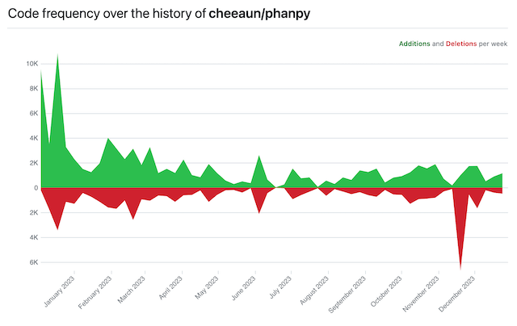
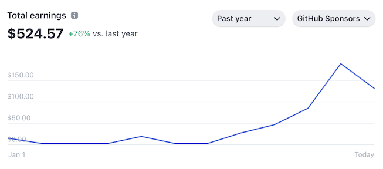
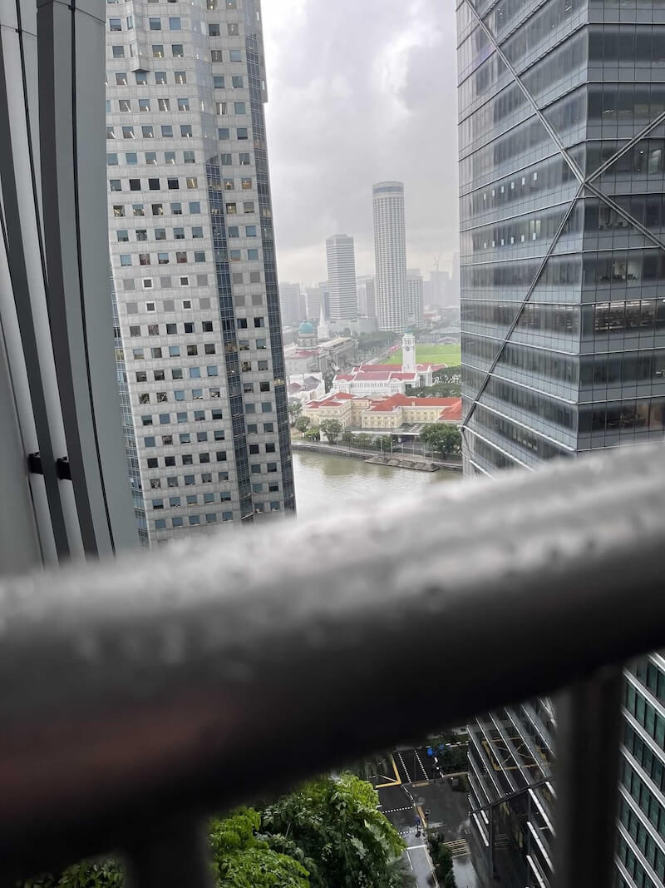

# 2023 in review

This is probably going to be short as this year is perhaps the most *unproductive* year I've ever had.

As usual, I start this off with a compilation of monthly "highlights" that I've already listed in my monthly newsletter.

**January**

- ⌨️ [Got](https://twitter.com/cheeaun/status/1612323029710962688) my first wireless mechanical keyboard.
- 👨‍🎨 [Made a diagram](https://twitter.com/cheeaun/status/1610608761017892865) with [Excalidraw](https://excalidraw.com/).
- 📹 [Made a nice video](https://twitter.com/cheeaun/status/1611385117511151617).
- 🎮 Played around with some pretty cool UI ([1](https://twitter.com/cheeaun/status/1616481971223552000)) ([2](https://twitter.com/cheeaun/status/1619569217363406848)).

**February**

- 💉 [4th jab](https://twitter.com/cheeaun/status/1623882217591279621).
- 🫴 My [Tumblr account got restored](https://twitter.com/cheeaun/status/1625337207140786176).
- 💸 [Started paying for make.com](https://twitter.com/cheeaun/status/1625676926185779201) because it rained so much.
- 🙉 One of my apps [got reviewed in a podcast](https://twitter.com/cheeaun/status/1628278265084510208).

**March**

- 🎨 Did a [simple 3D thing](https://twitter.com/cheeaun/status/1633445236117585920).
- ✨ Made some [shiny progress](https://twitter.com/cheeaun/status/1634444189927718914).
- 📥 [Dropped](https://twitter.com/cheeaun/status/1634767934496321536) my token.
- 💿 [Upgraded](https://twitter.com/cheeaun/status/1640522135318716417) to Ventura 13.3 and iOS 16.4.

**April**

- 🙈 Found a way to [redact text with pure CSS](https://twitter.com/cheeaun/status/1645367833143156738).
- 📊 Did [some pretty cool multi-column UI designs](https://mastodon.social/@cheeaun/110161529140061736).
- ✋ One of my Twitter app got [suspended](https://twitter.com/cheeaun/status/1647812067532095488).
- 🐛 Found [a really weird bug](https://twitter.com/cheeaun/status/1648179311076323328) with `<datalist>`
- 📖 Visited [a new regional library](https://twitter.com/cheeaun/status/1650519857283190785).

**May**

- 😩 [My old Yahoo! Mail account entered inactive state for 1+ year](https://twitter.com/cheeaun/status/1653960020739129344). All contents were deleted. Really miss [my chain mails 🙈](https://mastodon.social/@cheeaun/110308228969136068)
- 🗺️ Made a [cool demo for Google Maps’ Photorealistic 3D tiles](https://twitter.com/cheeaun/status/1657727482492235777) and [got featured on Maps Mania](https://googlemapsmania.blogspot.com/2023/05/explore-world-with-shadows.html).

**June**

- 📲 Trying out [iOS 17 beta](https://twitter.com/cheeaun/status/1666434624183205889), as always (every year).
- 🦊 [Worried](https://twitter.com/cheeaun/status/1666715041444552705) about Firefox.
- 🤩 [Learned a life hack](https://twitter.com/cheeaun/status/1667561737686753281) on how to eat yoghurt without a spoon.
- 👴 Got [older](https://twitter.com/cheeaun/status/1670824387807973376).

**July**

- 🥳 My web app finally [got listed](https://mastodon.social/@cheeaun/110679292160877444).
- 👖 Somehow got [really](https://mastodon.social/@cheeaun/110673460301613219) [impressed](https://mastodon.social/@cheeaun/110735711383890220) by a K-pop group called [NewJeans](https://en.wikipedia.org/wiki/NewJeans).

**August**

- 🌳 Did [a little 3D trees tinkering](https://mastodon.social/@cheeaun/110897788209607546).
- ☕ Attended the [55th KopiJS hangout](https://mastodon.social/@cheeaun/110956706365734154).

**September**

- 🤔 Learned something about `less` and `jQuery` thanks to [GitHub’s new newsfeed](https://mastodon.social/@cheeaun/111038906809296287)
- 😢 My iCloud backup [has been failing](https://mastodon.social/@cheeaun/111101478267068776) since updating to iOS 17 stable (from beta)
- 🚀 Made [some](https://mastodon.social/@cheeaun/111010846374607712) [interesting](https://mastodon.social/@cheeaun/111029713309952535) [changes](https://mastodon.social/@cheeaun/111069603769790908) [on](https://mastodon.social/@cheeaun/111075447089809397) Phanpy (my web app project).

**October**

- 🫣 Tried to use [iOS 17’s new “Screen Distance”](https://mastodon.social/@cheeaun/111158531945120251) feature. Gave up after a week, too annoying.
- 😩 Got [annoyed by YouTube’s anti-adblocker attempts](https://mastodon.social/@cheeaun/111250732556057144).

**November**

- 📜 Did some cool [CSS scroll-driven animations](https://mastodon.social/@cheeaun/111340601508143964).
- 🥂 [Fediversary](https://mastodon.social/@cheeaun/111358866164358949)
- 📦 Tried the [Wayback Machine tweets archive tool](https://mastodon.social/@cheeaun/111431854315671651).
- 🥳 [10th anniversary of KopiJS](https://mastodon.social/@cheeaun/111492674906861143).

**December**

- 👀 [Looked for alternatives](https://mastodon.social/@cheeaun/111519612674154599) to GitHub Copilot.
- 🎁 Did my [#GitHubUnwrapped](https://mastodon.social/@cheeaun/111575786019192213).
- 🎉 It’s been [one year of building Phanpy](https://mastodon.social/@cheeaun/111584407791644659).
- 😎 First time [trying out GPT-4 with Vision](https://mastodon.social/@cheeaun/111647227648224117).

## Extended unemployment

I was expecting at most 1-year of unemployment before I get bored and wanting to start work again.

But somehow I don't feel like working yet. Feels like a gut feeling thing or I'm still feeling fatigued. There's a sense of guilt building up but I decided to just do what I want and not get pressured or stressed by it.

Roughly one year after my unemployment, [tech layoffs](https://layoffs.fyi/) were *still* happening, so it doesn't feel like things are going to be smooth-sailing yet. It's quite and not quite post-pandemic at the same time, as most folks are still working from home on some days of the week as part of the "new normal" working arrangements. Not a lot of tech meetups too, compared to pre-pandemic days.

## Projects

I should say, just one project, not project*s*.

I've spent the whole year working on [Phanpy](https://github.com/cheeaun/phanpy), a 3rd-party web client for [Mastodon-compatible social networks](https://joinmastodon.org/). It's been surprisingly enjoyable and challenging, as I use *all* my front-end chops, design skills, usability knowledge and years of experience on creating my *ideal* social media client.

I've added so many cool features since the first inception [last December](https://mastodon.social/@cheeaun/109515757404630583).

- **Thread count indicator** – automatic marking of "1/X" on threaded posts so that authors don't have to type it themselves.
- **Boosts Carousel** – group all reposted posts from the timeline into separate horizontal-scrolling carousels to prevent them from hogging the timeline.
- **Multi-column mode** – Tweetdeck-like UI for multiple configurable columns of timelines.
- **Post translation** – full-fledged translation UI with auto-detection of source text, configurable source language and even includes pronunciation text.
- **(Non-native) Quote posts** – links to other Mastodon/Fediverse posts will be expanded to look like quote posts.
- **Web Push notifications** – push notifications on the web, a feature that's more widely available now since [the release of iOS 16.4](https://webkit.org/blog/13878/web-push-for-web-apps-on-ios-and-ipados/).
- **Profile posting stats** – quick visualisation of an account's posting habits showing percentage of original posts, reposts and replies within the last specific number of days.
- **"ALT" badge & inline captions** – Instead of just showing ALT badges, they're also conditionally inlined like image captions.
- **Experimental image description generator** – using [GPT-4 with Vision](https://platform.openai.com/docs/guides/vision) to [generate description for images](https://mastodon.social/@cheeaun/111647227648224117) when posting images.
- And… a whole bunch of small UI tweaks and bug fixes.

I'm quite proud of this. It's pretty hard to explain or describe in words, thus I feel that folks should really try the web app to "get it".

I find myself surprised that I'm able to focus on *one* project as I usually get distracted easily to start another new project or shift focus to one of my existing projects.

It feels good to focus on building a product, *not* during your "free time" or after-work hours, and really just laser-focus on delivering the best user experience without tight deadlines, the need to chase numbers, or reach certain KPI's.

Thanks to Phanpy, my sponsorship grew quite significantly on [Buy Me a Coffee](https://www.buymeacoffee.com/cheeaun) and [GitHub Sponsors](https://github.com/sponsors/cheeaun). I really appreciate all the donations! 🙇‍♂️.

## Looking back

Despite having more than a year to think about my next steps, I didn't really put much thought in the end. After 1.5 years of unemployment, I started to get used to this, which is something that I never thought that I could. Time passed by so fast while everyone else continue working, meeting friends, and travelling.

I'm grateful that I have the luxury to be jobless for this long. I'm still able to spend on things that I want. I could go to places like art museums during weekdays while everyone else is working.

There's still a lot of things in my mind. A lot of to-dos and future planning.

But, I'm just too lazy to think.

And I want to convince myself that it's fine to be lazy.
