2024 in review
===

This is pretty late, but really, no hurry. This would probably feel like a repeat of my [2023 review](/blog/2023/12/2023-in-review/).

**January**

- 😔 Got disappointed by [recent events](https://mastodon.social/@cheeaun/111738006561135999).
- 📢 Made [a statement](https://mastodon.social/@cheeaun/111800322951422386) that it’s impossible for an app to make everyone happy.

**February**

- 😮 Gathered quite a lot of attention from [an experimental UI that I did for catching up on posts on Mastodon](https://mastodon.social/@cheeaun/111896223599048036).
- 🤩 My web app got [mentioned](https://mastodon.social/@cheeaun/111953041035052351) on [The Verge Installer](https://www.theverge.com/2024/2/18/24075077/bose-ultra-open-superlist-bulletin-text-files-note-apps-installer).
- 🧑‍✈️ [Experienced using Copilot](https://mastodon.social/@cheeaun/111962861983335753) on error logs in Edge browser’s DevTools console.
- 🏷️ Had fun [CSS-ing a rubber stamp effect](https://mastodon.social/@cheeaun/111975618073302953).
- 🤩 My web app also got [mentioned by @gruber](https://mastodon.social/@gruber/111981343339926289)
- 🚌 BusRouter.SG got "[featured](https://mastodon.social/@cheeaun/112014821617338182)" on [Vulcan Post](https://vulcanpost.com/853238/a-redundant-solution-sbs-transit-odd-partnership-getgo-will-not-work-out/).

**March**

- 👨‍🎨 Did a mockup of how a “[social address](https://mastodon.social/@cheeaun/112099567913409079)” look like.
- 🗺️ Discovered [a cool change (small green arrows) on Google Maps](https://mastodon.social/@cheeaun/112116343005327189).
- 📰 Phanpy got [featured on the Fediverse Report](https://fediversereport.com/last-week-in-fediverse-ep-59/).

**April**

- 🚏 Discovered [a new bus stop](https://mastodon.social/@cheeaun/112193824054476828).
- 📢 Phanpy got [mentioned on an article by Anuj Ahooja](https://www.augment.ink/threads-on-mastodon/).
- 📰 Also [got featured on Hacker News front page](https://mastodon.social/@cheeaun/112272819404197934).
- ☕ Attended [59th](https://github.com/KopiJS/kopi.js/issues/83) [KopiJS meetup](https://www.instagram.com/p/C6QUFXZLJSr/?img_index=1).

**May**

- 🌅 My side project, Phanpy, featured on [Stefan’s article about the impact of clients on the use of alt text](https://stefanbohacek.com/blog/impact-of-fediverse-clients-on-the-use-of-alt-text/).
- 🕵️ Discovered[ some interesting trends with Alt text badge UI’s](https://mastodon.social/@cheeaun/112521696071830465).
- 📣 Phanpy [got mentioned by creator of Metafilter](https://xoxo.zone/@mathowie/112452420619405557).

**June**

- ☕ Attended [Kopi.JS #60](https://github.com/KopiJS/kopi.js/issues/84)
- 🩸 Glad to know that my project [reduced someone’s frequency of blood pressure rise](https://mastodon.social/@cheeaun/112573664009207608) 😂
- 📰 My project got mentioned on [The Verge Installer again](https://www.theverge.com/24173628/ai-pc-raspberry-pi-hit-man-rivian-chromatic-installer).
- 📰 My project also mentioned on [Elena Rossini’s article](https://blog.elenarossini.com/the-future-is-federated/).
- 🎨 Simon [mentioned my project](https://fedi.simonwillison.net/@simon/112607271918614961) and even [dug back my old artwork from 21 years ago](https://fedi.simonwillison.net/@simon/112623074315449711) 🫣
- 🧵 [Played](https://mastodon.social/@cheeaun/112637550017255276) with Threads API and built [a bot account](https://mastodon.social/@cheeaun/112652048630617032).
- 👴 Got [older](https://mastodon.social/@cheeaun/112644156124583200).
- 💸 Shared a little about [my Chrome extension 13 years ago](https://mastodon.social/@cheeaun/112680415737826525).
- 🌦️ Showed off [my phone Lock Screen when it rains](https://mastodon.social/@cheeaun/112703309557195063).

**July**

- 🥞 Ranted about [the lack of SQLite in the browser](https://mastodon.social/@cheeaun/112721893441434571).
- ☑️ Learnt about [`border-start-start-radius`.](https://mastodon.social/@cheeaun/112870354072210776)

**August**

- 💬 [Huge i18n change on Phanpy](https://mastodon.social/@cheeaun/112932794480750449), complete with pseudo-localization and [RTL support](https://mastodon.social/@cheeaun/112988040458901250).
- 🤔 Wondered about ["Invalid Date"](https://mastodon.social/@cheeaun/112965379291705351)
- 👨‍🎨 Rant about [designers naming things](https://mastodon.social/@cheeaun/112994750087135818).
- 😮 Surprised that [phones caught up to 16GB RAM](https://mastodon.social/@cheeaun/113003122727484838).
- 🔐 Learnt about [PKCE in OAuth](https://mastodon.social/@cheeaun/113020903361859381).

**September**

- ✨ [Phanpy finally reached 1K stars](https://mastodon.social/@cheeaun/113085806767795566) after almost 2 years.

**October**

- 🤔 Had some thoughts on [Markdown parser](https://mastodon.social/@cheeaun/113284142730485812).
- 🎙️ Phanpy got [mentioned on the FLOSS Weekly podcast](https://mastodon.social/@cheeaun/113334251884552237).
- 🤔 Had some [thoughts about Arc browser](https://mastodon.social/@cheeaun/113376918704535534).
- 👴 Reminiscing on [my Boosts Carousel invention](https://mastodon.social/@cheeaun/113390558800518056).
- ☕ Attended [Kopi.JS #61](https://github.com/KopiJS/kopi.js/issues/85)

**November**

- 🤔 Wondered about [the dynamics of how job interviews are conducted](https://mastodon.social/@cheeaun/113451268717905353).
- 🚛 [Migrated my CheckWeatherSG bot](https://mastodon.social/@cheeaun/113485296763121994).
- 🎉 [11th anniversary of Kopi.JS](https://mastodon.social/@cheeaun/113565133745330113).

**December**

- 🎁 Got my [#Wrapstodon](https://mastodon.social/@cheeaun/113586545081308960).
- 🎙️ Phanpy got [reviewed in a podcast again](https://mastodon.social/@cheeaun/113694212513866821).
- 🚀 Started working on [an experimental web client for Bluesky](https://bsky.app/profile/cheeaun.com/post/3le7pto6ht72j).

Newsletter
---

Right after June, I quietly stopped posting my newsletter. The last issue was [the 34th](https://cheeaun.substack.com/p/2-years-of-funemployment-34), with the subject "2 years of (f)unemployment". I was kind of surprised that it's been two years, and my fun little newsletter ran for almost 3 years, since [2021](/blog/2022/01/2021-in-review/).

I think a combination of events sort of made me stop. This newsletter thing starts to become like a chore. There's not enough dopamine release that social media posts give via likes, reposts or replies. Newsletters only show clicks and views, which may not be accurate. I've seen how other (tech and non-tech) newsletters thrive by increasing subscriptions or getting sponsorships, so maybe that's how they could sustain that long.

There are also [some](https://news.ycombinator.com/item?id=40156057) [issues](https://news.ycombinator.com/item?id=38962571) with Substack around that timing and there's no easy (and free, depending on number of subscribers) way to migrate out of it.

Honestly, the only parts I miss from writing my newsletter are the "Interesting discoveries" and "Neat bookmarks" sections. I [mentioned](/blog/2022/01/2021-in-review/) this before:

> This also reminds me of the times when I always share cool stuff to whoever sitting beside me at work, in the office, which is impossible now due to work-from-home setting.

If I'm going to revive my newsletter, I'll probably just focus on these but again, I'm not sure if anyone would want that. When I stopped posting, I didn't really get any feedback or questions from my subscribers, which is probably just the nature of how e-mails work? If you don't get the e-mails one day, it's hard to notice them or probably they accidentally end up in the spam folder. There's already so many e-mails that you need to sift through every day, so missing one doesn't matter much anyway.

Thinking about it, above points might apply to blog posts too. Though I guess blog posts "live" on the web so it has a permanent and timeless place, while e-mails drop in your inbox where it's ephemeral. Substack does give a "web presence" to the e-mails but it's kinda "closed" and too Substack-specific. When I [moved from Revue to Substack](https://cheeaun.substack.com/p/moving-to-substack-16) in 2022 ([Revue was shutting down](https://techcrunch.com/2022/12/14/twitter-shuts-down-revue-its-newsletter-platform/)), a lot of the older issues are now 404-ed and there's no way to redirect them.

So, if I want this to be more long-lived, might as well convert my "newsletter" into a blog? There probably won't be any easy and free newsletter platforms in near future because sending e-mails are not free. Converting every e-mail subscriber to RSS/Atom feed subscriber seems to make more sense.

One approach that I've been keeping my eyes on is [Simon's "Link blog"](https://simonwillison.net/2024/Dec/22/link-blog/).

> I realize now that link blogging deserves to be included a third category of low stakes, high value writing. We could think of that category as **things I’ve found**.
>
> That’s the purpose of my link blog: it’s an ongoing log of things I’ve found—effectively a combination of public bookmarks and my own thoughts and commentary on why those things are interesting.

Imagine a list of links, with commentary – duh, that's what I did in my newsletter.

I'm not sure how I would start this yet, considering the tech used in my blog, the demands from anyone who want to read my link blog, and the amount of effort to make this work and not succumb to it feeling like "chore" again.

Keeping this in mind for now.

Very extended unemployment
---

Time passes by really fast.

I'm passively, not actively, looking for jobs but the overall job market vibe is not the same as pre-pandemic days. The same job posts from the same companies appearing over and over again for the past 2 years. Companies seem to have lost interest in hiring front-end developers, but more into generic "software engineers". There's no new exciting startups that catch my eyes. Some companies are on hiring freeze. My LinkedIn and Twitter DMs are filled with messages from people telling me to upvote their Product Hunt submissions. Layoffs are [still very happening](https://www.businesstimes.com.sg/companies-markets/layoffs-and-job-cuts-singapore-2024) unfortunately.

Things look pretty bleak. I keep telling myself that if I graduated from university around this timing, it would be even worse. Which makes me wonder, how are the folks from coding bootcamps doing now?

It feels like a privilege that I even have the capacity to worry about others while being jobless for more than 2 years.

I've been joking to people that I'm "retired", but honestly in the current economic state, that's impossible.

Two years of not working does weird things to the brain. Side projects keep me sane. Watching anime series keep me sane. Walking, with light exercises, keeps me sane. Exploring new places like a tourist, keeps me sane. Taking random scenic photos keeps me sane. Randomly meeting up with people keeps me sane. Taking a long bus ride under the rain keeps me sane.

But there's a limit. Time slows down. Things start to get boring from time to time. My brain starts to hallucinate and I keep asking myself, why do I go to work in the first place? What did I want to do? "Change the world" as what startups used to say? What's my origin story ([My Hero Academia](https://en.wikipedia.org/wiki/My_Hero_Academia) reference)? Am I just working because everyone else is working? Do I want go back to being a code monkey or try more executive roles? Are my skillsets still relevant? Should I still do [glue work](https://news.ycombinator.com/item?id=42570390) and get overlooked?

I'm starting to understand why some older folks don't want to retire. Jobs took most of the time in our lives, morning till night, 5 days a week, they keep the brain occupied with things that seem important, they provide financial income to improve our lifestyles, and the whole process repeats for many, many, many years.

But…

Where's the "fire"?

I realised that I say this in every job interview: "I just want to build cool things that help people." It's the very thing that keeps me "alive" but years of work, intertwined with the pandemic and various events, has manage to put it off.

One day, a [soundtrack](https://www.youtube.com/watch?v=HmlbpdeYpkk) (*Yuujin a-Kun Wo Watashi No Bansousha Ni Ninmei Shimasu*) suddenly started playing in my head. It's one of my favourites, from an anime that I watched few years ago, called "[Shigatsu wa Kimi no Uso](https://myanimelist.net/anime/23273/Shigatsu_wa_Kimi_no_Uso)" ([Your Lie in April](https://en.wikipedia.org/wiki/Your_Lie_in_April)).

> Fourteen-year-old piano prodigy Kōsei Arima becomes famous after winning several music competitions. When his mother Saki dies, Kōsei has a mental breakdown while performing at a piano recital; this results in him becoming unable to hear the sound of his piano, even though his hearing is otherwise unaffected.
>
> Two years later, Kōsei has not touched the piano and views the world in monochrome.

Obviously, I'm not a prodigy and my "story" is not that dramatic. But "unable to hear the sound of his piano" and "views the world in monochrome" part sounds very similar.

My work is also not like music that could transcend words and connect people in ways that words alone can't.

Though, I really wished that it could.

Looking back
---

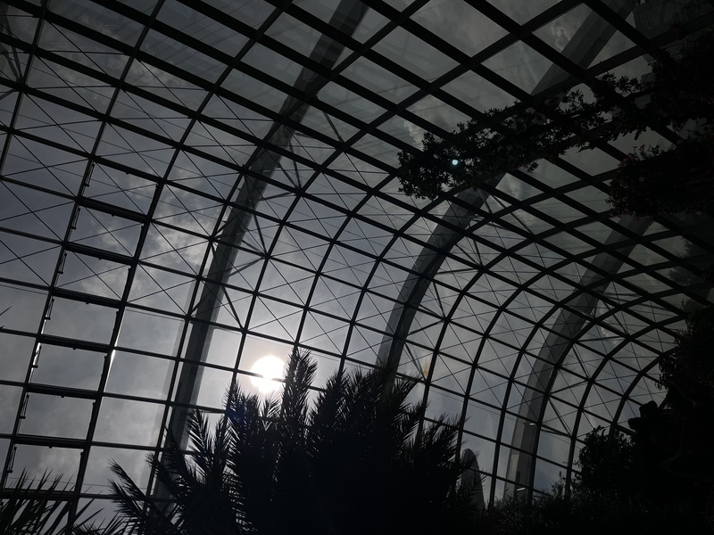

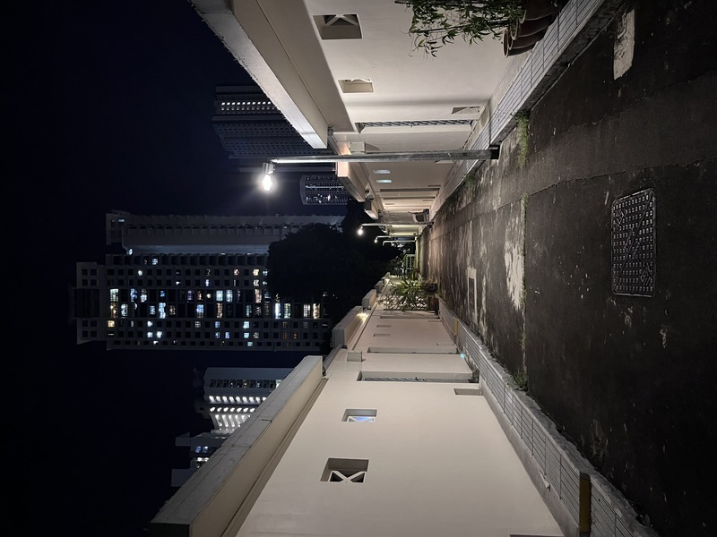

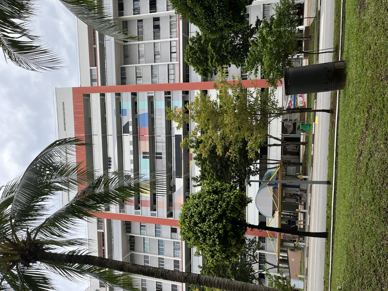

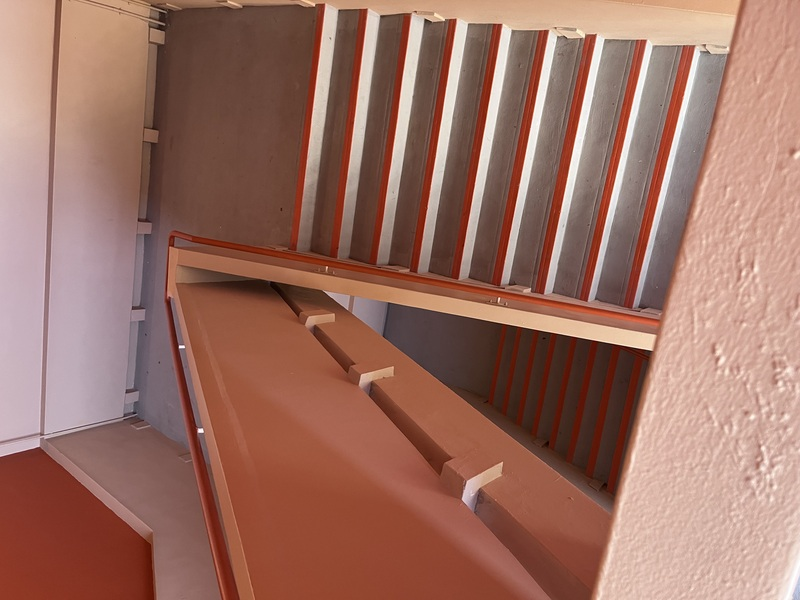

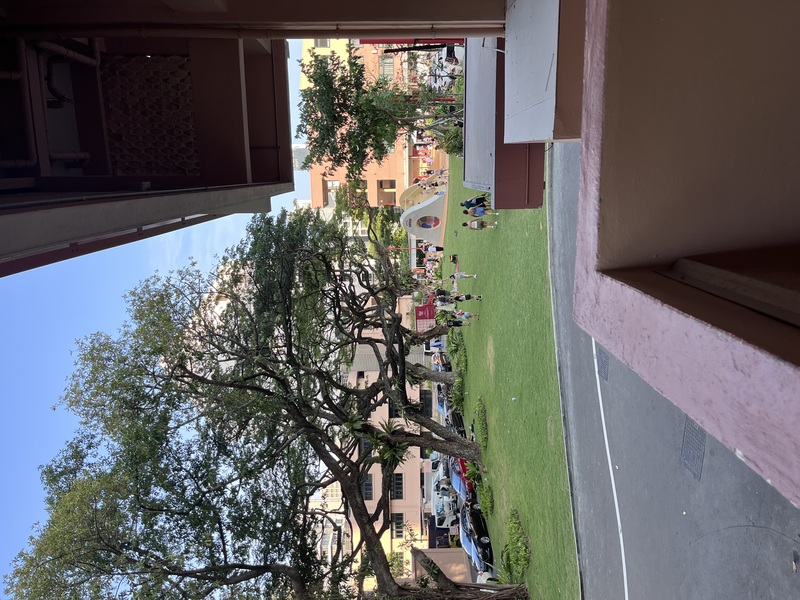

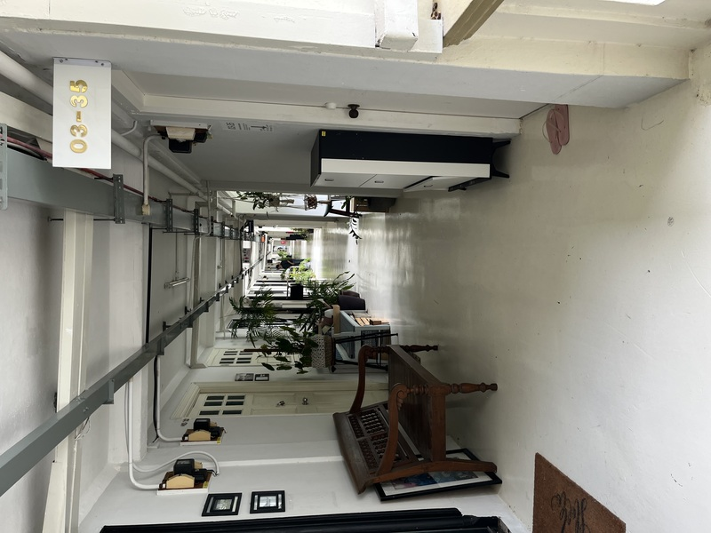

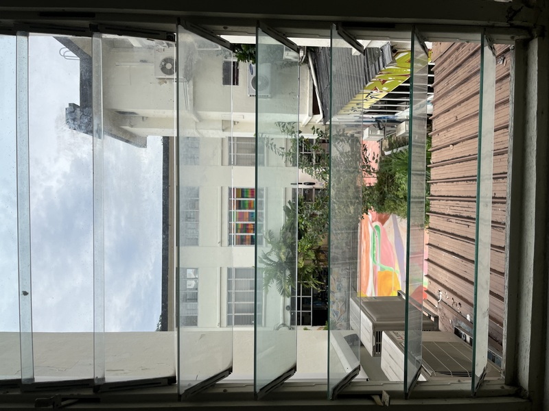

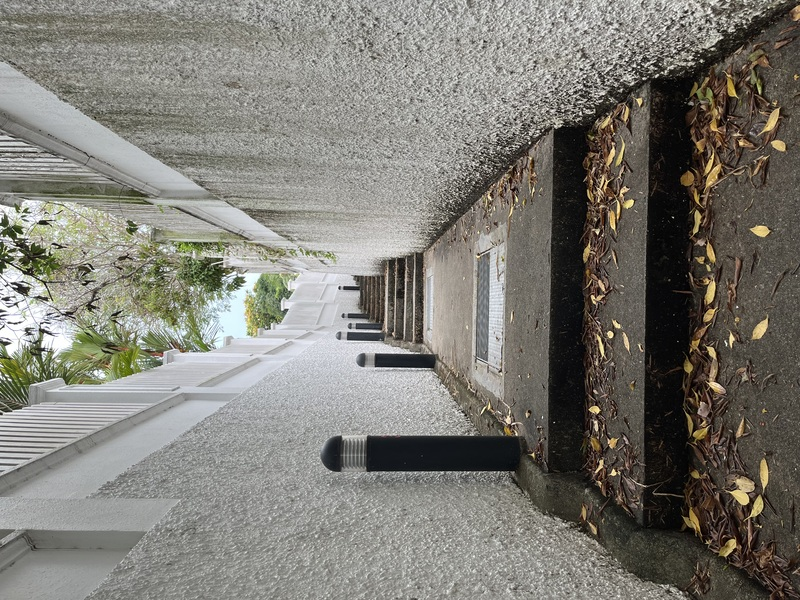

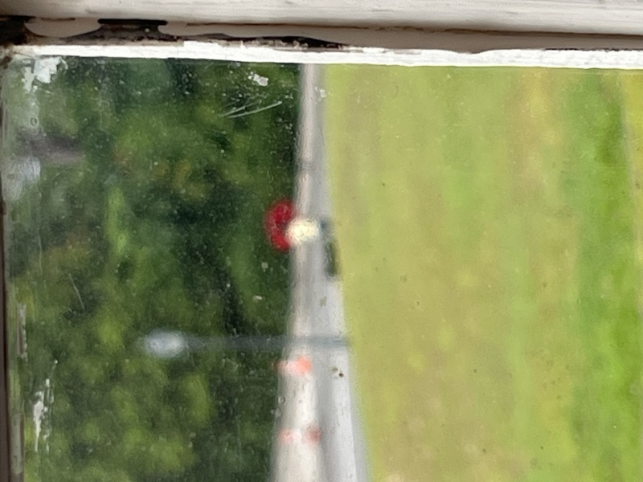

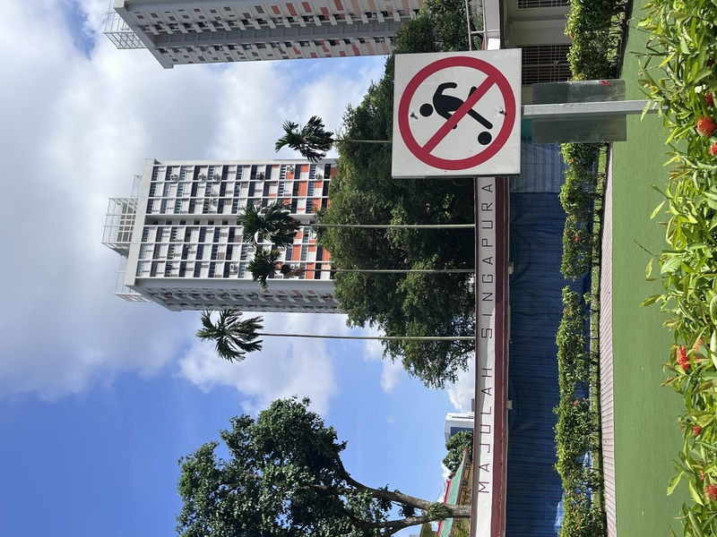

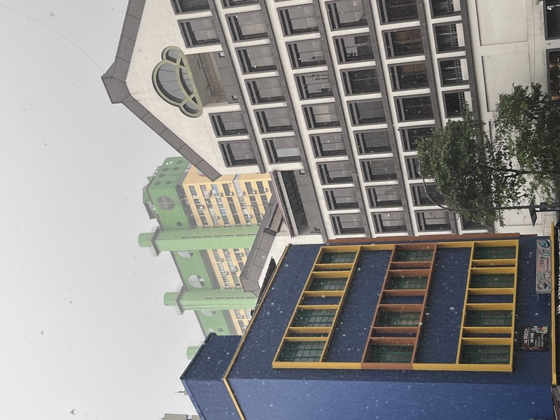

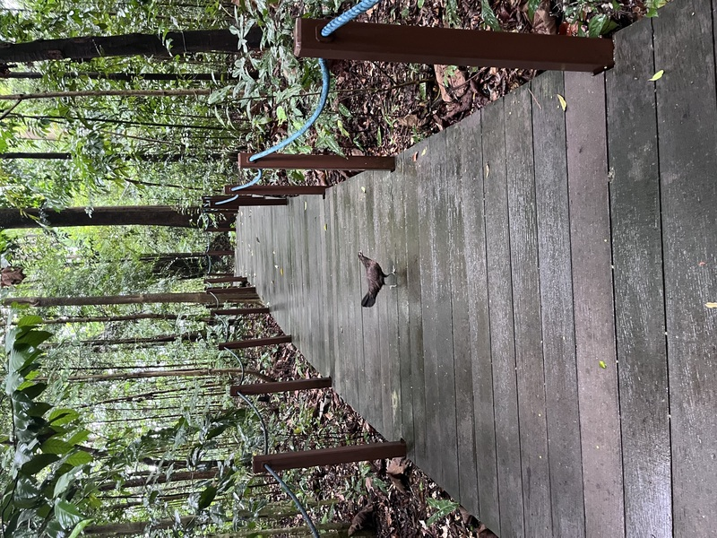

I'm not a professional photographer, but I really like taking these random photos, despite not travelling anywhere outside of Singapore.

Taking long walks and capturing these moments give me time to pause and think.

Everything around me has changed so much, and I'm constantly yearning for pre-pandemic days. I realised that I've inevitably downgraded from a mice to one of those "littlepeople" in [Who Moved My Cheese?](https://en.wikipedia.org/wiki/Who_Moved_My_Cheese%3F), a book I read many years ago.

Again, I don't know what's going to happen.

Hopefully there's still a spark somewhere out there.