2025 in review
===

Back to my *ritual* of writing annual reviews.

**January**

- 🙏 Made a [web dev wishlist](https://mastodon.social/@cheeaun/113799164264894990). Only one is checked in the end.
- 🤖 Made [a bot](https://mastodon.social/@cheeaun/113826068433133218) [with BotKit](https://mastodon.social/@cheeaun/113833019917192734).
  
- 😩 Ranted [about UX](https://mastodon.social/@cheeaun/113889240442161844).

**February**

- 🎧 Hoping that [AirPods Pro will have self-cleaning feature](https://mastodon.social/@cheeaun/113960248954188558).
- 🌐 Experimented using [Language detection and translator APIs](https://mastodon.social/@cheeaun/114081619667642589).

**March**

- 🤔 Wondering about ["mockup as a service"](https://mastodon.social/@cheeaun/114160647931006112).

**April**

- 📊 Built a [browser extension that visualizes (Service Worker) Cache Storage for web sites](https://mastodon.social/@cheeaun/114339962315074336).

**May**

- 🔋 [Battery replacement](https://mastodon.social/@cheeaun/114470918223042608) for my iPhone 13 mini. Free, surprisingly.
- 📔 Built [my own version of Storybook](https://mastodon.social/@cheeaun/114494995294330803).
- 🤖 Having [thoughts about AI and browsers](https://mastodon.social/@cheeaun/114549056215375753).

**June**

- 🙈 My name [got mentioned](https://mastodon.social/@cheeaun/114659269992038684) in a [video](https://blog.elenarossini.com/fediverse-video/).
- 🖥️ Ranted about [mockups starting with large viewports](https://mastodon.social/@cheeaun/114715512561540752).
- 👴 Got [older](https://mastodon.social/@cheeaun/114716231071171534). The Big 4-O.

**July**

- ⌨️ Bought [a new portable keyboard (again)](https://mastodon.social/@cheeaun/114817148974863638).
- 🥃 Experimented with [a "Liquid Glass"-effect wallpaper](https://mastodon.social/@cheeaun/114941715635756601).

**August**

- 🗺️ Getting [excited](https://mastodon.social/@cheeaun/114985449711810341) about [Apple Maps DCE (Detailed City Experience) in Singapore](https://www.reddit.com/r/singapore/comments/1mjp6m8/apple_maps_dce_detailed_city_experience_in/).
- 🚌 My BusRouter SG web app got [featured](https://mastodon.social/@cheeaun/115025528906514405) on [CNA Insider's video](https://www.youtube.com/watch?t=248&feature=shared&v=_BURy2_mGZM).

**September**

- 🎧 Bought [AirPods Pro 3](https://mastodon.social/@cheeaun/115183002742951789).
- 😑 Ranted about [cursors and smooth rounded edges of macOS Tahoe](https://mastodon.social/@cheeaun/115211936124931938).

**October**

- 🔕 Getting [spam GitHub notifications](https://mastodon.social/@cheeaun/115383299807627794).
- 💈 [Made](https://mastodon.social/@cheeaun/115417377939230723) a [cool CSS demo with `marquee`](https://codepen.io/cheeaun/pen/OPMvRJO).
- 🏁 [Submitted my entry](https://mastodon.social/@cheeaun/115426444671648424) to [Bad UX World Cup](https://badux.lol/) and didn't win.
- 😭 Ranted about [proprietary formats in the design industry](https://mastodon.social/@cheeaun/115468370271773117).

**November**

- 🔍 Found a [weird server limit on Discord](https://mastodon.social/@cheeaun/115548314526128813).
- 👀 Saw the [Cloudflare internal server error page](https://mastodon.social/@cheeaun/115570545374837195).

**December**

- 🦋 Got ["The Butterfly" archetype on Mastodon #Wrapstodon](https://mastodon.social/@cheeaun/115722909495583742).

Honestly looking at this list, I think some folks might think that this is AI-generated 😅 – I always use emojis for this list in most, if not all, my previous year-in-review posts.

Phanpy
---

It's been another year of developing Phanpy, my 3rd-party web client for Mastodon, so total up to [3 years](https://mastodon.social/@cheeaun/115723674656240039) now. It's still an enjoyable journey so far, as I continue implementing new ideas while keeping feature parity with official Mastodon.

Few of the interesting implementations:

- [Math (LaTeX) rendering](https://mastodon.social/@cheeaun/114856458121817802) – converts LaTeX markup to MathML.
- ["X months/years later" indicator](https://mastodon.social/@cheeaun/115077992755071832) – an idea borrowed from Discourse.
- [Edit History Snapshots](https://mastodon.social/@cheeaun/115151888570560625) – visualise edit history of a post.
- [Reply/Reply All](https://mastodon.social/@cheeaun/115355963388817389) – email-like reply buttons for posts.
- [Decal patterns](https://mastodon.social/@cheeaun/115389260615602242) – accessible patterns for charts.
- [QR code generator and scanner](https://mastodon.social/@cheeaun/115526126563215994) – for profiles and settings backup.
- [Image metadata reader](https://mastodon.social/@cheeaun/115597819198015079) – to be used for alt text.
- [Year in Posts](https://mastodon.social/@cheeaun/115751067284225457) – experimental visualisation of posts in a year.

Phanpy also got mentioned so many times that it's getting hard to keep track.

Thus, listing them down here:

[**Feb 4**](https://mastodon.social/@cheeaun/113944854329462085) — "[Potencia tu experiencia en Mastodon con Phanpy #Apps](https://www.tupodcast.com/@comopiensodigo/episodes/potencia-tu-experiencia-en-mastodon-con-phanpy)" (podcast) – translated to English as "Boost your Mastodon experience with Phanpy"

[**Mar 5**](https://mastodon.social/@cheeaun/114127322242897138) — "[Leaving the City of Big Social, with Fediverse Enthusiast Chris Trottier](https://dot-social.simplecast.com/episodes/chris-trottier)" (podcast) – transcribed from Mike McCue:

> I mean, I'm incredibly excited to see, you know, there's a fantastic front end called *FanP*. That's a fantastic user experience.

[**Apr 8**](https://mastodon.social/@cheeaun/114299369556936032) — "[Trunk & Tidbits, March 2025](https://blog.joinmastodon.org/2025/04/trunk-tidbits-march-2025/)" (article):

> There was a [big update](https://mastodon.social/@cheeaun/114149642985452634) to [Phanpy](https://phanpy.social/), a progressive web app client for Mastodon.

[**Apr 24**](https://mastodon.social/@cheeaun/114420119680637910) — "[【(ﾟ∀ﾟ)!!】マストドン界の黒船？！噂のミニマルWebクライアント「ファンピー(Phanpy,social)」を丸裸にしちゃうぞ！☆彡　#四24](https://dopingconsomme.blogspot.com/2025/04/phanpy-minimal-mastodon-client-review.html)" (article) – honestly the most hilarious "review" I've ever read 🤣

[**Jun 26**](https://mastodon.social/@cheeaun/114823953269102292) — "[423: Operation Endgame, deepfakes, and dead slugs](https://www.smashingsecurity.com/423-operation-endgame-deepfakes-and-dead-slugs/)" (podcast) – recommended as part of "Pick of the week"

[**Jul 24**](https://mastodon.social/@cheeaun/114964387917276250) — "[Comfort Zone, Episode 59: I am Full-on Bananza](https://www.youtube.com/watch?v=KEg3dmi9_c4)" (podcast) – on a 15-minute chapter called "We're phans of Phanpy"
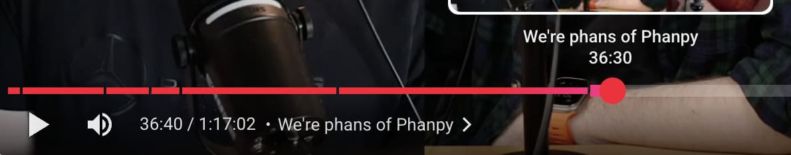

[**Aug 9**](https://mastodon.social/@cheeaun/115007839891051199) — "[We Distribute Live — Sean Tilley — FediCon 2025](https://spectra.video/w/eLFTfynpY7yXksD6Am26sW)" (video) – *Anuj Ahooja* gave a quick call-out on Phanpy.
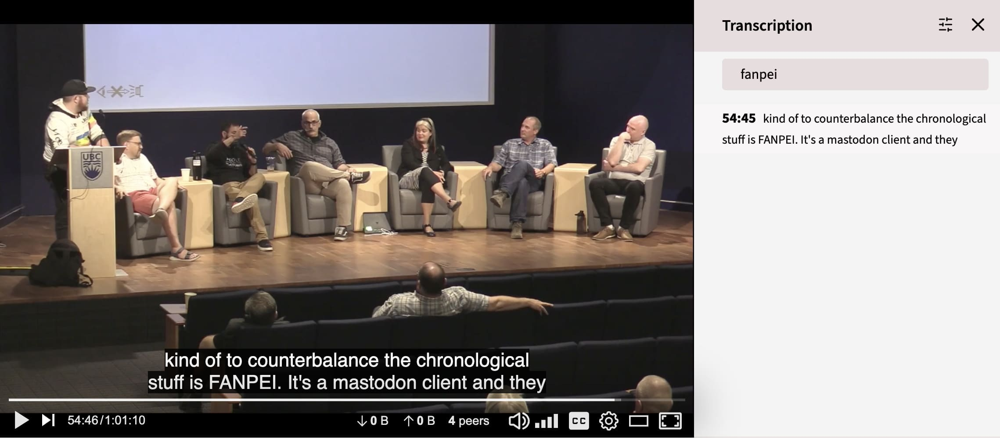

[**Aug 17**](https://mastodon.social/@cheeaun/115068371499517936) — "[Taking a Fresh Look at the Fediverse](https://media.ccc.de/v/froscon2025-3346-taking_a_fresh_look_at_the_fediverse)" (video) – a talk at [FrOSCon](https://froscon.org/en/) by *David Roetzel*, backend developer at Mastodon:
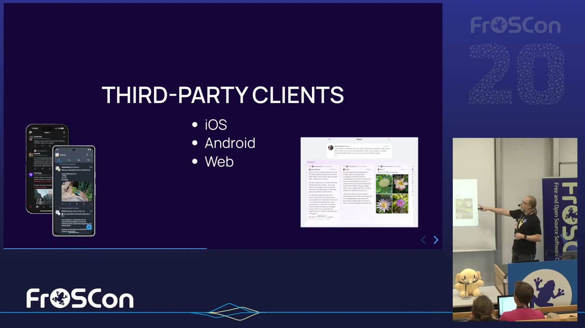

> I have a screenshot here which is from a very nice one called Phanpy. Phanpy is doing a lot of innovation on the user interface side and actually when we develop new features today, we always look at hmm… how does Phanpy solve it because they have some very cool ideas.

[**Aug 20**](https://mastodon.social/@cheeaun/115064182458931834) — "[Introduction to AT Protocol](https://mackuba.eu/2025/08/20/introduction-to-atproto/)" (article) – small mention under "Client Apps" section:

> All browsing is done through a separate client, and the client always does everything through the public API – kind of like when you run a custom web client for Mastodon like [Elk](https://elk.zone/) or [Phanpy](https://phanpy.social/), you connect it to your instance, and you view your timeline on [elk.zone](https://elk.zone/).

**Sep 26** — "[WTN #8: The New Rock Stars of Web Development](https://webtechnology.news/wtn-8-the-new-rock-stars-of-web-development/)" (article)

> 🦣 Meanwhile, Mastodon app developers are coming to grips with the new quote posts. I use [Phanpy](https://phanpy.social/?ref=webtechnology.news) for my Mastodon browser app (it's awesome)…

[**Oct**](https://mastodon.social/@cheeaun/115428819865785846) — "[#fediday2025 Elena Rossini - The Future is federated](https://c-tube.c-base.org/w/sFSzvrMMbx1sU5yjoM1cyh)" (video)
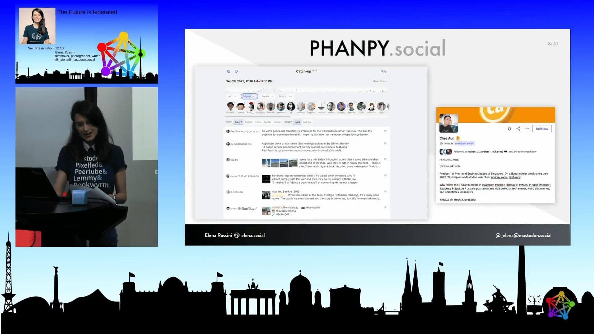
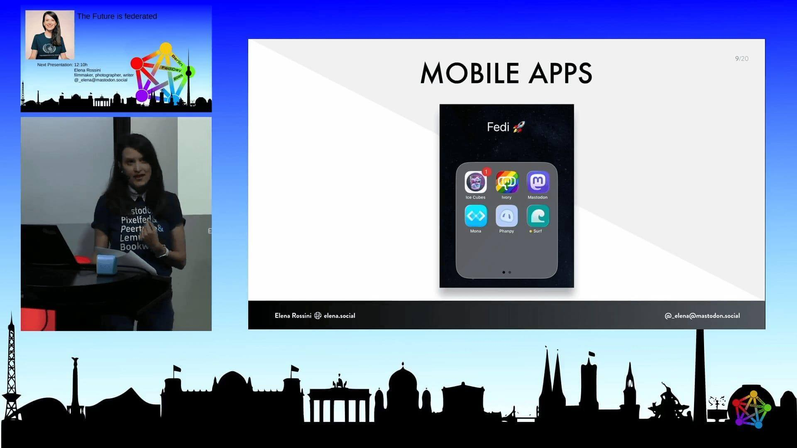

**Nov 3** — "[Time to Migrate](https://www.tbray.org/ongoing/When/202x/2025/11/03/Time-to-Migrate)" (article)

> But iOS people should check out [Ivory](https://apps.apple.com/us/app/ivory-for-mastodon-by-tapbots/), Androiders should look at [Tusky](https://tusky.app/), and everyone should try [Phanpy](https://phanpy.social/). I live in Phanpy on both my Mac and my Pixel — it’s a Web thing but installable as a PWA on both Android and iOS.

**Nov 8** — "[Mastodon 4.5](https://simonwillison.net/2025/Nov/8/mastodon-45/)" (article)

> The first is support for quote posts. This had already become an unofficial feature in the client apps I was using ([phanpy.social](https://phanpy.social/) on the web and [Ivory](https://apps.apple.com/us/app/ivory-for-mastodon-by-tapbots/id6444602274) on iOS) but now it's officially part of Mastodon's core platform.

**Nov 13** — "[Comfort Zone, Episode 75: Klack to the Extreme](https://www.youtube.com/watch?v=G5L0TW-quBo)" (podcast)

**Nov 14** — "[Kendzior Case-Study](https://www.tbray.org/ongoing/When/202x/2025/11/13/Kendzior-Case-Study)" (article)

> I use [Phanpy](https://phanpy.social/), which has a hilarious little animation with an animated rubber stamp that leaves a red-ink “Spam” or whatever on the post you’re reporting.

**Nov 26** — [*Flock of Cats* made a quick video about Phanpy](https://famichiki.jp/@FlockOfCats/115611365473826497) (video).

**Dec 10** — "[Useful patterns for building HTML tools](https://simonwillison.net/2025/Dec/10/html-tools/)" (article)

> Mastodon has generous CORS policies too, as used by applications like [phanpy.social](https://phanpy.social/)

And that's… pretty much all the coverage, I think.

It's always great to see folks enjoying the app I've built, and somehow my UI experiments kind of worked well for others besides myself.

Side quests
---

Being unemployed for so long, I do feel like I'm just *casually* cruising along this uncertain path with everyone else struggling to keep their jobs, trying to pave through high rents and increasing prices. Layoffs were still happening like it's a normal thing now.

Unbounded by dominating working hours, I manage to do quite a number of "side quests", which are pretty much the *little* things that I enjoy doing.

Like… taking photos of buildings.

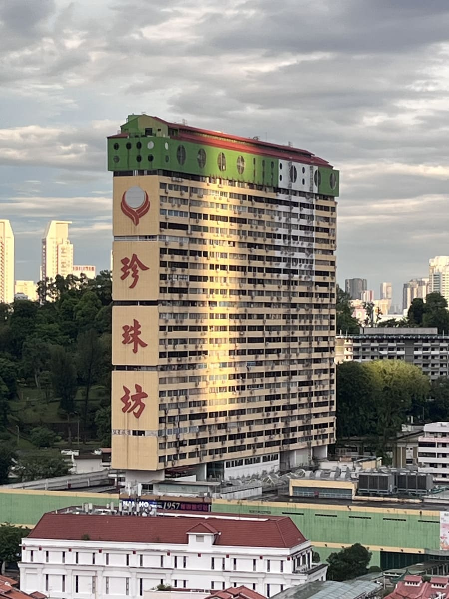

The iconic People's Park Complex in Chinatown, before [repainted red](https://www.straitstimes.com/singapore/peoples-park-complex-being-repainted-red-and-white-but-not-specifically-for-sg60). Past sunrise. Shadows from tall skyscrapers of the [CBD](https://en.wikipedia.org/wiki/Central_Business_District,_Singapore).

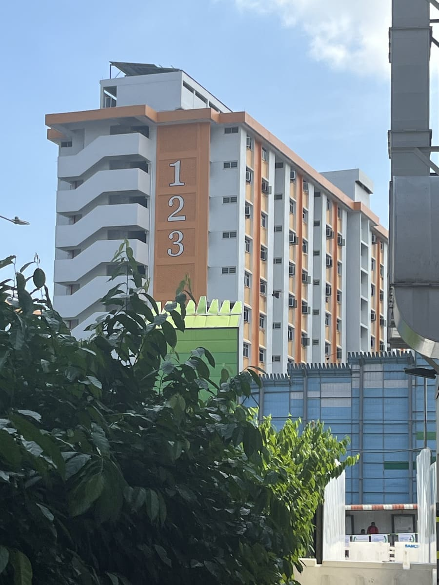

A random orange-and-white [HDB](https://en.wikipedia.org/wiki/Housing_and_Development_Board) block numbered 123. Construction noise barriers behind the bus stop at bottom right.

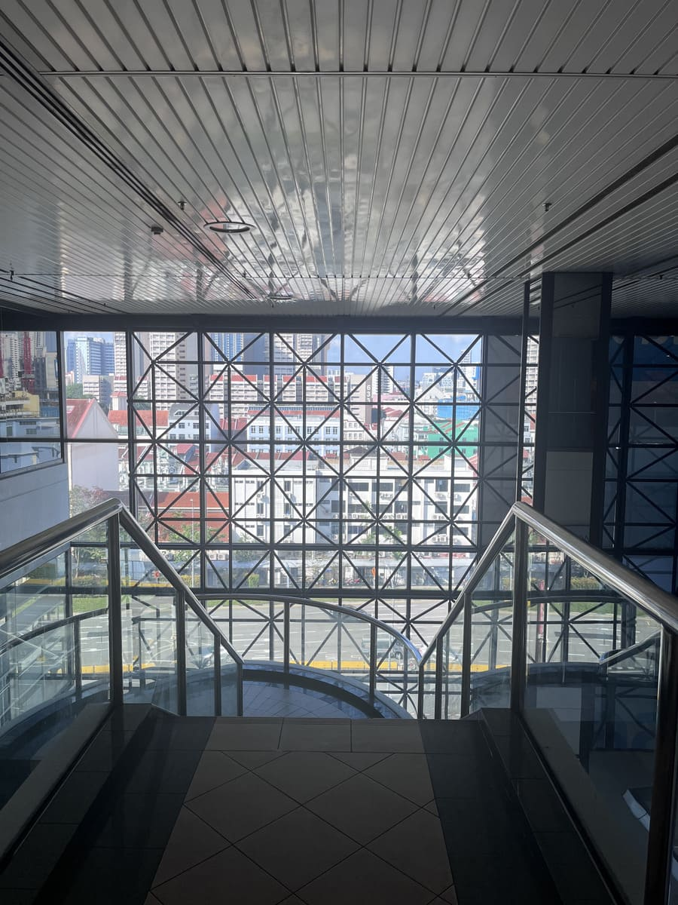

One of the top floors of Sim Lim Square, overlooking the roads through towering glass panels.

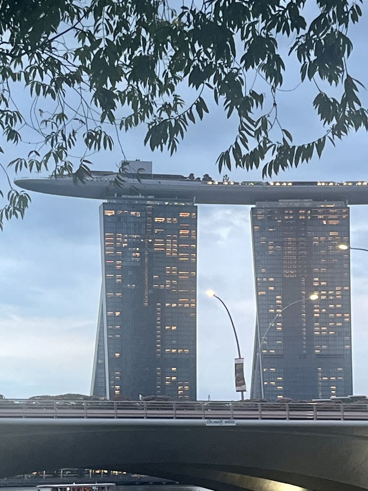

Marina Bay Sands and Esplanade Bridge, viewed from the seats of Queen Elizabeth Walk. Almost sunset.

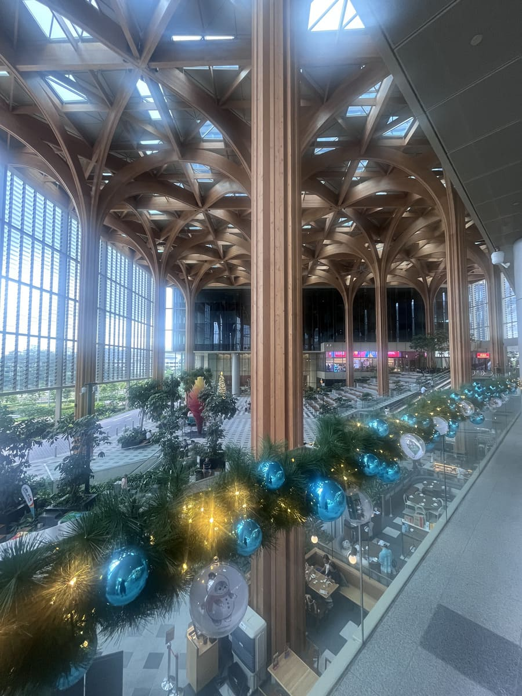

Christmas decorations at Geneo.

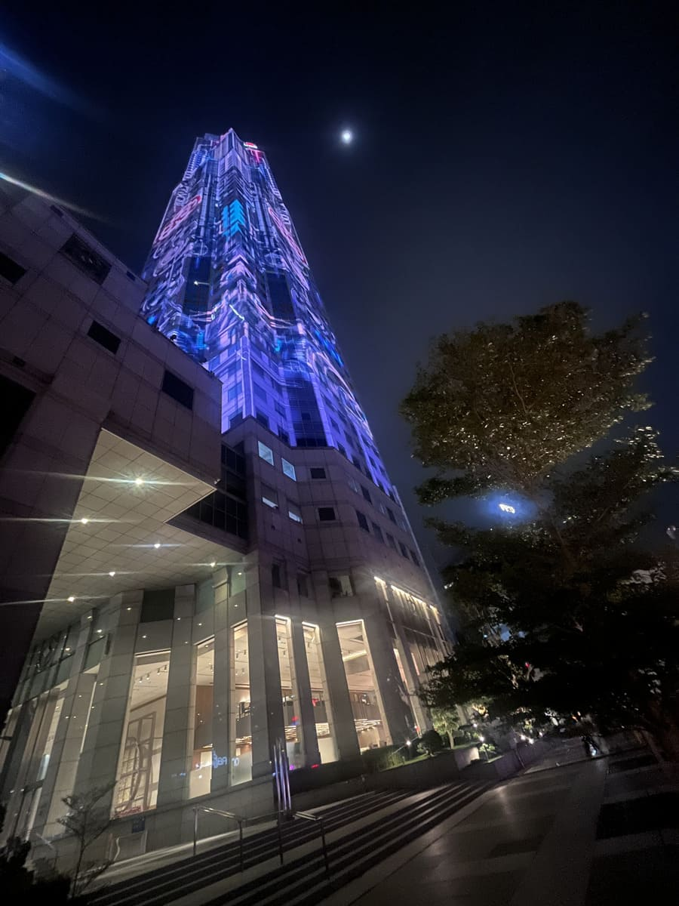

Projection light show on UOB Plaza's skyscraper.

I've also visited *The Hidden Green*, a 6×12m artwork and data storytelling project about Singapore’s urban trees, at the Singapore Art Museum (Tanjong Pagar Distripark). I got to know this project from [Kontinentalist](https://kontinentalist.com/) folks [who worked on them](https://www.linkedin.com/posts/kontinentalist_weve-just-unveiled-the-hidden-green-a-brand-new-activity-7313489115641966593-sg7T) and informed me that they've referenced one of my side projects 😉

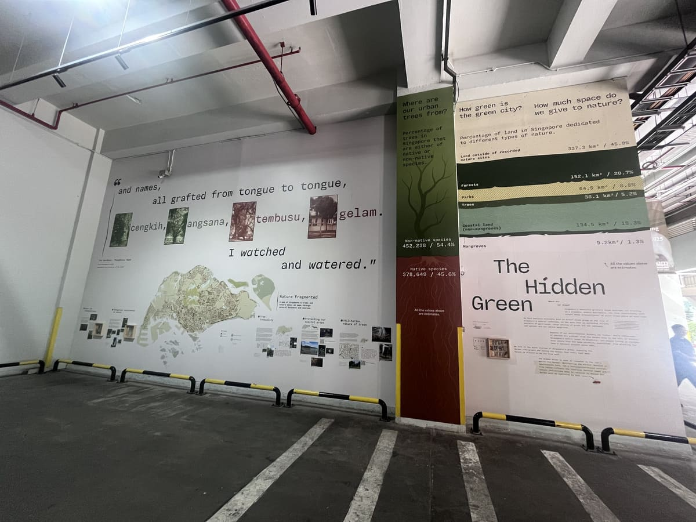

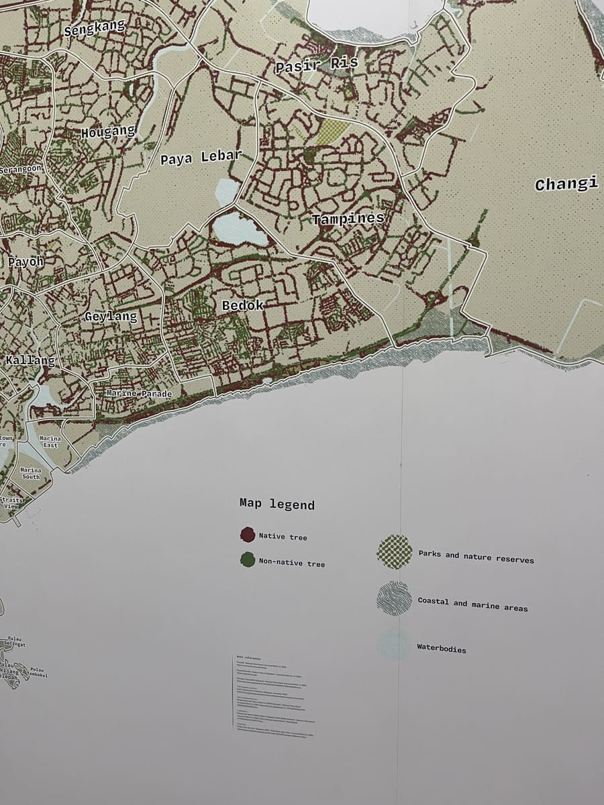

At the bottom right edge of the Singapore map, there's a section that says "Map legend".

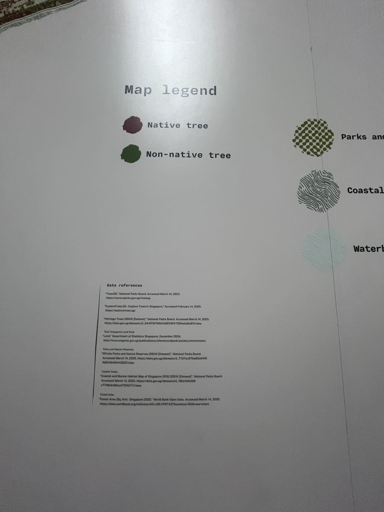

There's a small print below "Map legend" section. Zoom in…

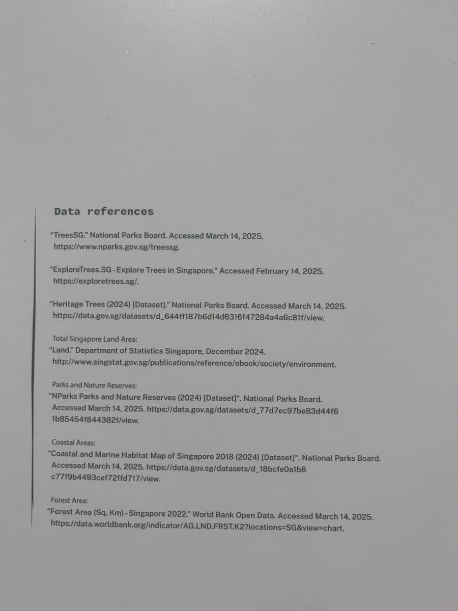

Here's the small "Data references" section. One of the references is my [ExploreTrees.SG](https://exploretrees.sg/) side project 🤩.

It's pretty cool to see a *physical* data visualisation work instead of digital ones, though I always wonder if the work will be preserved digitally when the wall gets repainted for other works, or when [Singapore Art Museum moves back to its previous location in Bras Basah](https://www.straitstimes.com/life/arts/sam-to-stay-at-tanjong-pagar-distripark-for-now-plans-pending-for-old-st-joseph-institution-building).

Anyway, I also got to explore random food places in Singapore, mostly ticking off to-go/to-try places in my list bookmarked on Google Maps. And also, on a quest to try new places before… they *potentially* close down 🥲

Yes, it's in the news:

- [The 2025 F&B roller coaster – so far, so dizzying](https://www.straitstimes.com/life/food/the-2025-fb-rollercoaster-so-far-so-dizzying)
- [Commentary: As more restaurants shut, is it time to rethink Singapore’s F&B rules?](https://www.channelnewsasia.com/commentary/food-and-beverage-restaurant-close-home-based-business-regulations-5237076)
- [Of F&B closures in 2025, 82% of those registered for up to 5 years had never made a profit: MTI](https://www.businesstimes.com.sg/singapore/economy-policy/fb-closures-2025-82-those-registered-5-years-had-never-made-profit-mti)
- [Majority of F&B outlets here that closed in 2025 did not last over five years: MTI](https://www.straitstimes.com/singapore/community/majority-of-fb-outlets-here-that-closed-in-2025-did-not-last-five-years-mti)

It's pretty obvious when I check my bookmarks, a few of them unexpectedly show "Permanently closed" after a year or even within less than a year 😥

Despite having a lot of bookmarks, it's technically **impossible** for any one person to go to *all* places in Singapore. It's because a few months ago, [Singapore citizens received cash vouchers of up to S$800 each](https://www.channelnewsasia.com/singapore/sg60-vouchers-baby-gift-income-tax-rebate-budget-2025-4944576) to [mark the country's 60th birthday](https://www.channelnewsasia.com/singapore/singapore-pa-lawrence-wong-sg60-punggol-4722646). It's called the [SG60 Vouchers](https://www.cdc.gov.sg/sg60-vouchers/) which works the same way as [CDC Vouchers](https://vouchers.cdc.gov.sg/). Only specific places accept these vouchers, so I [built a much better alternative UI](https://www.reddit.com/r/singapore/comments/1m7181q/made_an_alternate_ui_for_cdc_voucher_locations/) than the [official one](https://www.gowhere.gov.sg/cdcvouchers). There are over **24,000 places** that accept these vouchers, while not all of them are hawker stalls or restaurants, they are still *way too many*. The list of places is also updated almost daily, so I [built a tracker](https://www.reddit.com/r/singapore/comments/1mdo9eg/keep_track_of_new_places_to_spend_cdc_vouchers/) which shows a *changelog* for places added, removed or edited 🙈.

If let's say there are 20,000 F&B outlets, and a person visits two every day, it would take more than **27 years** to visit them all! Take note that SG60 Vouchers will expire on 31 December 2026 🤣.

In conclusion, supporting local businesses ultimately depends on the collective effort of everyone in the country 😇.

All I can do is just best-effort support, despite still unemployed, and trying my best to treat it as a mini-adventure.

In no particular order, and not an exhaustive list…

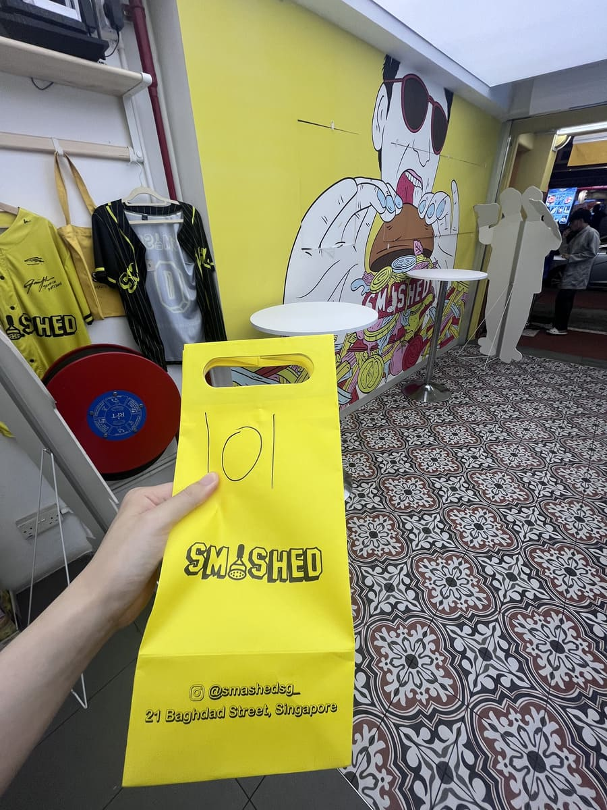

Smashed burgers, which I randomly ordered as takeaway after I saw the place while walking around Kampong Glam. Not sponsored, by the way.

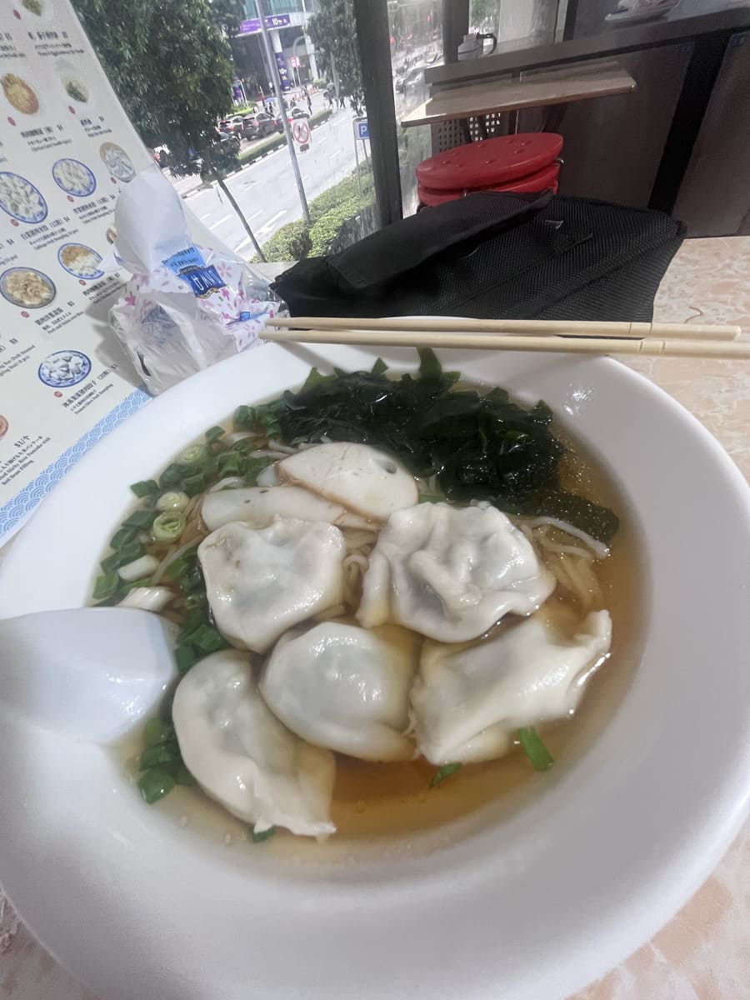

Chive Pork Dumpling Noodle from [A9 Noodle Dumpling](https://sethlui.com/a9-noodle-dumpling-singapore/) at Fortune Center.

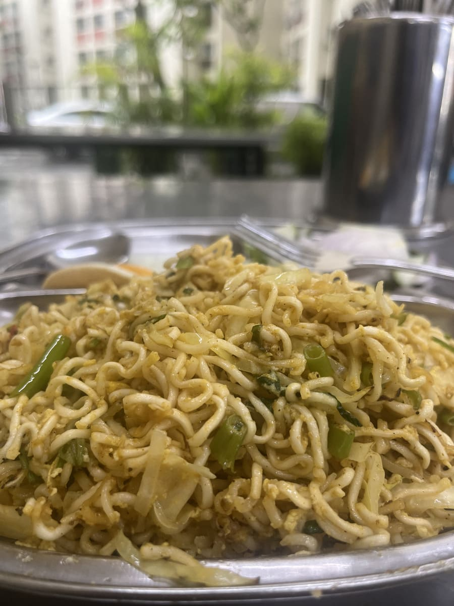

*Maggi goreng putih*. Yes, "Putih" is the [keyword](https://mothership.sg/2021/06/maggi-goreng-red/).

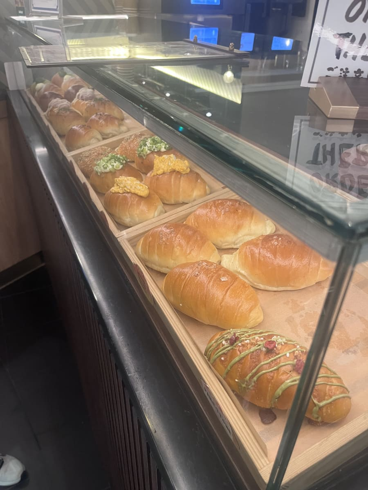

*Shio pan* (salt bread) was trending for a while, so I tried a few from [Shio and Sato](https://shioandsato.com/). As expected, the bread was… salty 😆, though it has that extra crispy texture which I find interesting 🤔

Around August, I stumbled upon a site called [Acuppa](https://acuppa.app/), a directory listing of home-based businesses in Singapore. They were [quite trending for some time](https://www.businesstimes.com.sg/opinion-features/home-based-eateries-have-taken-are-they-here-stay), deemed [viable alternatives to traditional F&Bs](https://www.straitstimes.com/singapore/st180-your-singapore-story-home-cafe-discovery-platform-acuppa), while also having their own [fair](https://mothership.sg/2025/06/home-based-cafes-singapore-legal-or-loud/) [share](https://www.8days.sg/eatanddrink/newsandreviews/beng-who-cooks-tiktok-nea-home-based-fb-destroying-licensed-food-operators-846681) of criticism.

Being curious, I tried a few of them.

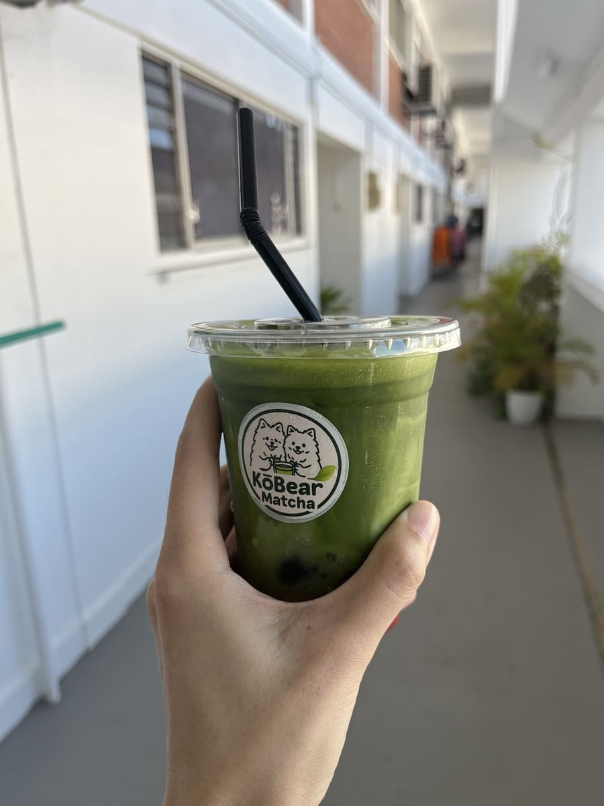

*Straw-Beary Pawcha Latte* from [KōBear Matcha](https://www.instagram.com/kobearmatcha/).

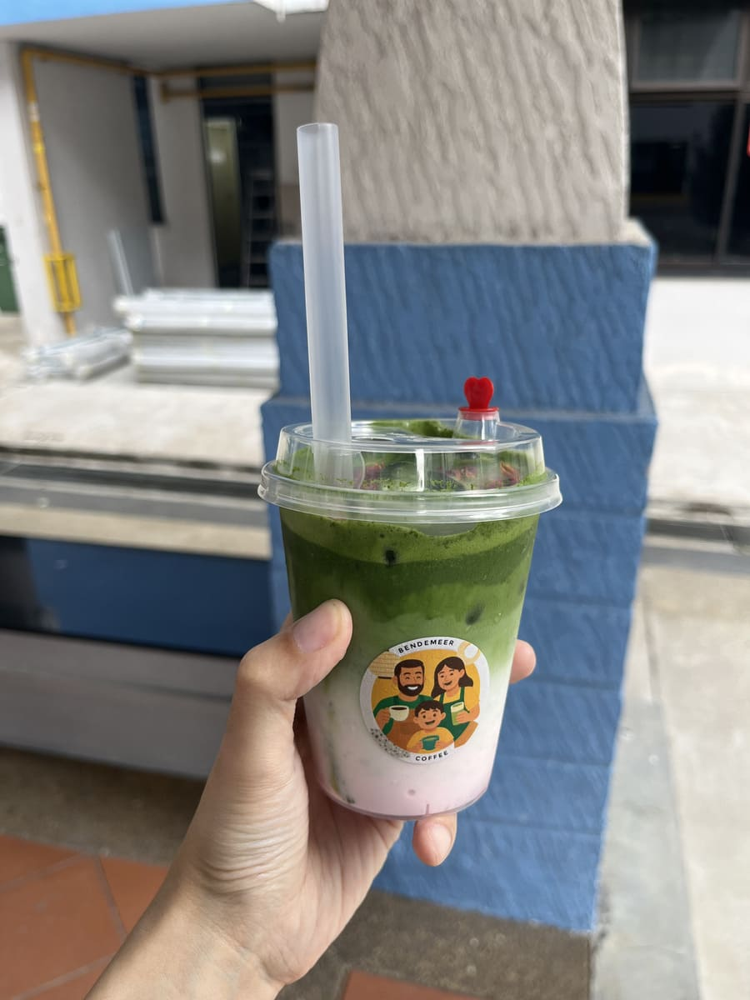

*Bandung Matcha* from [Bendemeer Coffee](https://www.instagram.com/bendemeercoffee/).

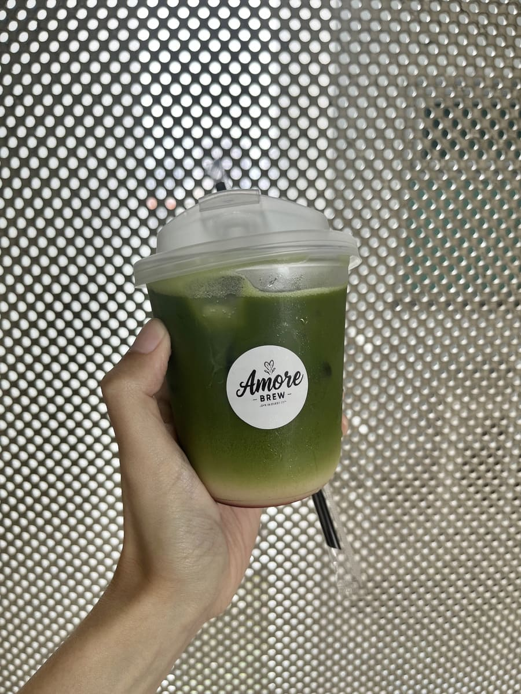

*Blushing Matcha Hug* from [amoRe brew](https://www.instagram.com/amorebrew.sg/).

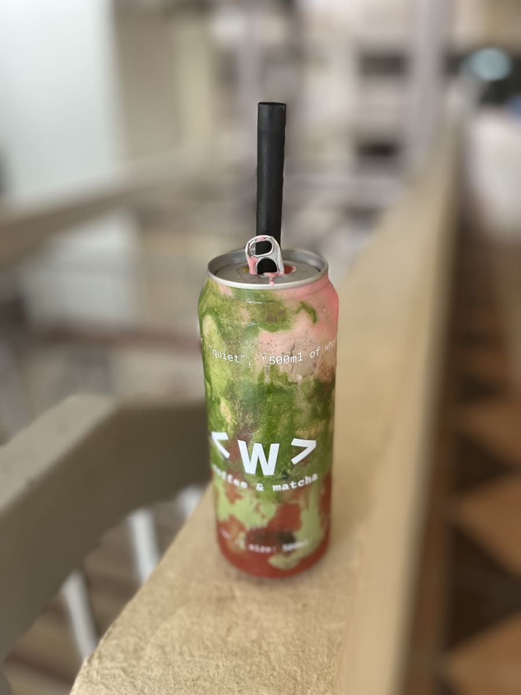

*Strawberry Bandung Cold Foam Matcha* from [Waterloo Coffee](https://www.instagram.com/waterloocoffeesg), originally a home-based business and [eventually opened a physical shop](https://danielfooddiary.com/2025/12/14/waterloocoffee/).

At this point, it's pretty obvious that [matcha](https://en.wikipedia.org/wiki/Matcha) is [quite trending](https://www.businesstimes.com.sg/companies-markets/consumer-healthcare/matcha-mania-hits-singapore-retail-prices-soar) to a point where many other drink stalls also start to offer matcha. Even 7-eleven stores sell matcha-flavoured oat milk cartons by Oatside 😅.

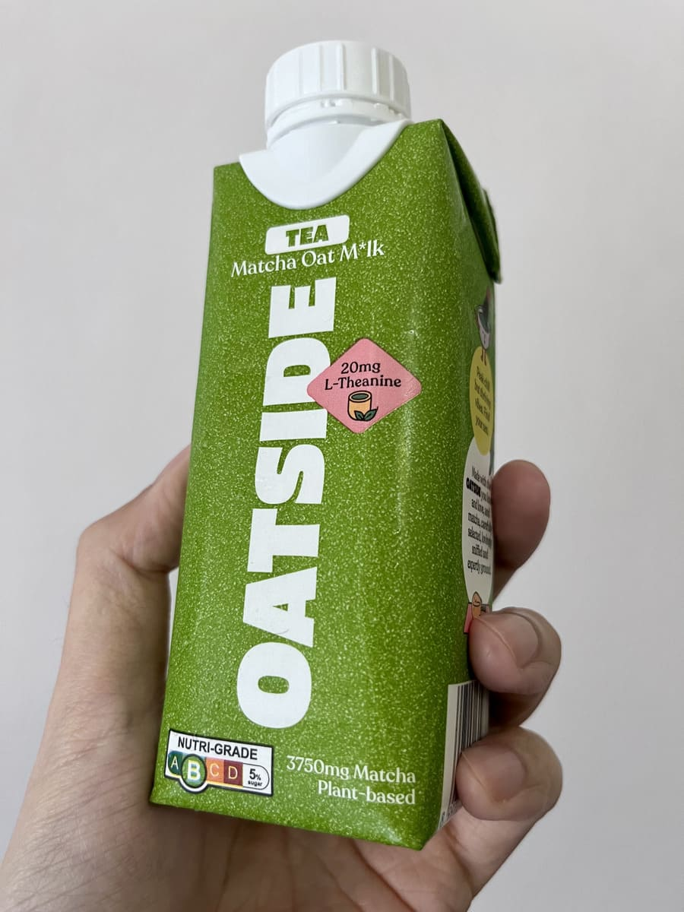

This trend feels weird because many years ago, I used to be [a little](https://www.instagram.com/p/m3arb2y90p/) [obsessed](https://www.instagram.com/p/-DFUiLS9-_/) [with matcha](https://www.instagram.com/p/BKuo5bpAz1l/).

Looking back
---

This might sound weird, but my first quarter of the year was carried by [Solo Leveling Season 2](https://myanimelist.net/anime/58567/Ore_dake_Level_Up_na_Ken_Season_2__Arise_from_the_Shadow). The intense adrenaline rush with diabolical cliffhangers truly kept me tensed with anticipation every week, to such a high boiling point that [everyone starts to hate those feet](https://www.reddit.com/r/sololeveling/comments/1j9n9gx/most_hated_feet_of_2025_ahhh_those_cliffhanger/) 🤣

Next few quarters, not much from anime unfortunately, tho' maybe a little from [Dr. Stone: Science Future Part 2](https://myanimelist.net/anime/61322/) and eventual ending of [Boku no Hero Academia: Final Season](https://myanimelist.net/anime/60098/).

[Bon Appétit, Your Majesty](https://en.wikipedia.org/wiki/Bon_App%C3%A9tit,_Your_Majesty) (k-drama) surprisingly brought a small spark of joy that awakened my appetite 😋

Apart from all of these, things generally stayed the same.

Rather I'm glad that things stayed the same instead of getting worse.

I mean, we still can't ignore all the crazy things that are happening around us, though it's been sort of *consistently* like that since… the pandemic?

Nevertheless, I'm grateful that some folks have reached out to me. Some have supported my work via thank-you's and donations.

All the little things matter.

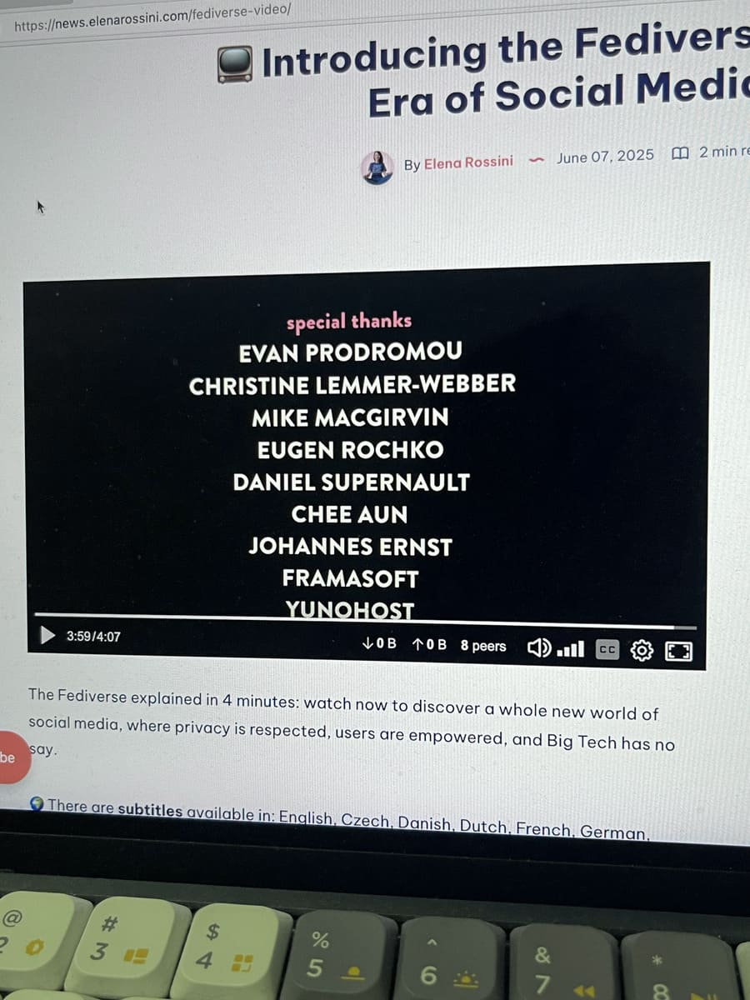
